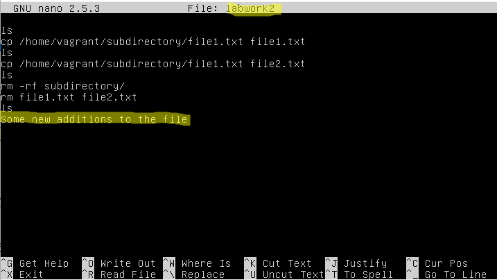
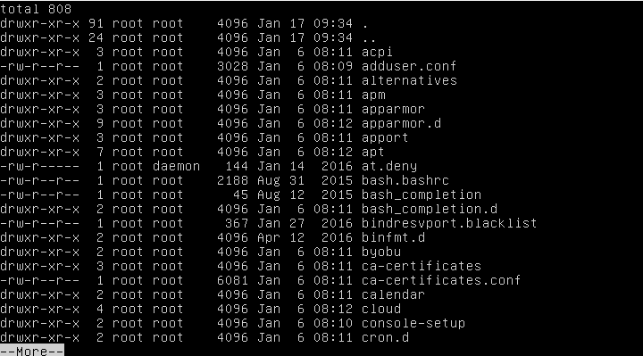

Task1.Part1

***

1) Log in to the system as root.  

***

2) Use the passwd command to change the password. Examine the basic parameters of the command. What system file does it change *?

***

When I typed "passwd -e vagrant" I logged out and logged in again. After that my shell told me that my password had expired so that I need to change it. 

3) Determine the users registered in the system, as well as what commands they execute. What additional information can be gleaned from the command execution?

Also I can check all the users existing in my computer with the help of the command "sed 's/:*//' /etc/passwd"

4) Change personal information about yourself.

***

5) Become familiar with the Linux help system and the man and info commands. Get help on the previously discussed commands, define and describe any two keys for these commands. Give examples.

***

6) Explore the more and less commands using the help system. View the contents of files .bash* using commands.

cd ~ && more -d -c .bashrc:

cd ~ && less -c -N .bashrc

***

7) Describe in plans that you are working on laboratory work 1. Tip: You should read the documentation for the finger command.

***

8) List the contents of the home directory using the ls command, define its files and directories. Hint: Use the help system to familiarize yourself with the ls command.

***

***

Part2

1) Examine the tree command. Master the technique of applying a template, for example, display all files that contain a character c, or files that contain a specific sequence of characters. List subdirectories of the root directory up to and including the second nesting level. 

tree -L 2 -R | grep c

***

2 )What command can be used to determine the type of file (for example, text or binary)? Give an example.

Command "file" can be used to determine type of the file:

***

3) Master the skills of navigating the file system using relative and absolute paths. How can you go back to your home directory from anywhere in the filesystem?

***

4) Become familiar with the various options for the ls    command. Give examples of listing directories using different keys. Explain the information displayed on the terminal using the -l and -a switches.
option "-a" lets you see even hidden files
option "-l" (long) displays additional information about the files in more readable form

***

5) Perform the following sequence of operations: 
-  create a subdirectory in the home directory;
-  in this subdirectory create a file containing information about directories located in the root directory (using I/O redirection operations);
-  view the created file;
-  copy the created file to your home directory using relative and absolute addressing.
-  delete the previously created subdirectory with the file requesting removal;
-  delete the file copied to the home directory.

***

6) Perform the following sequence of operations:
-  create a subdirectory testin the home directory;
-  copy the .bash_historyfile to this directory while changing its name to labwork2;
-  create a hard and soft link to the labwork2file in the test subdirectory; 
-  how to define soft and hard link, what do theseconcepts;
-  change the data by opening a symbolic link. What changes will happen and why 
-  rename the hard link file to hard_lnk_labwork2;
-  rename the soft link file to symb_lnk_labwork2 file; 
-  then delete the labwork2. What changes have occurred and why?

***

7)Using the locate utility, find all files that contain the squid and traceroute sequence.

***

8)Determine which partitions are mounted in the system, as well as the types of these partitions.

***

9)Count the number of lines containing a given sequence of characters in a given file.

***

10)Using the findcommand, find all files in the /etc directory containing the host character sequence.

***

11)List all objects in /etc that contain the ss character sequence. How can I duplicate a similar command using a bunch of grep? 

***

12)Organize a screen-by-screen print of the contents of the /etc directory. Hint: You must use stream redirection operations.

***

13) What are the types of devices and how to determine the type of device? Give examples.

There are exact commands to determine the type of the device. "lshw" is one of them. This command shows all the devices connected to the computer. This command isn't the only one which is enable to check your devices. "lsscsi", "lsspci", "lssusb", "lsscpu" also can do this but they show only partial information about the devices unlikely from "lshw".
For example, let's use "lshw | less":

To list all the types of devices we can use "lshw | grep \*"

***

14)How to determine the type of file in the system, what types of files are there?

Use command "file" to determine the type of the file. There are such types of files:
regural file
directory
symbolic link
door (dataflow between different processes)
device file
socket (sockets are used to provide a cooperation between two or more separated computers via TCP/IP)

***

15) List the first 5 directory files that were recently accessed in the /etc directory. 

***
