Task1.Part1

***

1) Analyze the structure of the /etc/passwd and /etc/group file, what fields are present in it, what users exist on the system? Specify several pseudo-users, how to define them?

***

The file "passwd" contains in the following data:

| 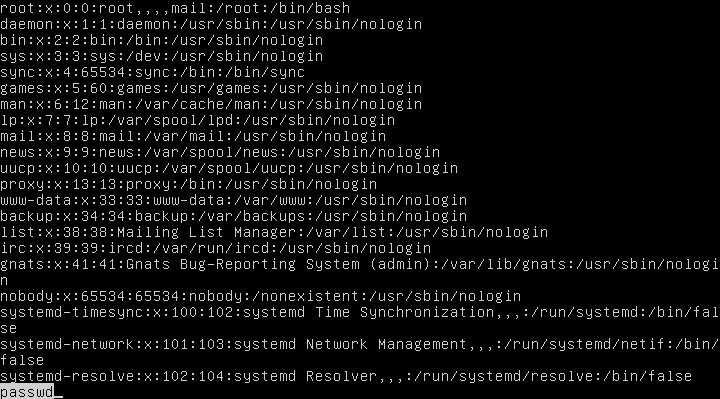 |
|:--:|
| <b> Img. 1.1 - Data in the file etc/passwd.</b> |

Passwd contains in data about all the users in the system.
Data about one user is placed in one line. Informaton is described by attributes.
There are such attributes as (sorted by order):
username: password: users id: grroup id: user's comments: directory: shell.

The file "passwd" apparently contains different data:
Passwd contains in data about all the groups in the system.
Data in this file described in the similar way, using attributes.
Order of the attributes in /etc/group:
group name: password for group: group id: users' list.
List field contains in list of all the users that belong to this group.

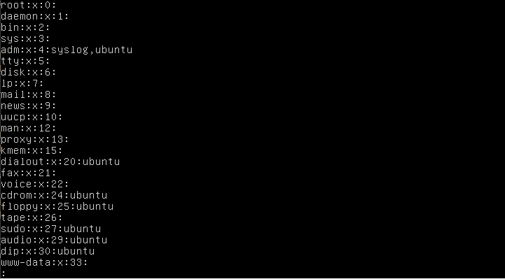

|  |
|:--:|
| <b> Img. 1.2 - Data in the file etc/group.</b> |

There are such types of users:
1. Root (super user with unrestricted access);
2. Common users (real people);
3. Pseudo-users (such as daemon, bin, nobody, sshd and adm).

Types of pseudo-users:
1. Daemons. They are responsible for system services;
2. Nobody is responsible for many different services;
3. Bin is responsible for ownership of executable commands;
4. Sshd used by secure shell services;
5. Adm owns registration files.

ID's numbers below 1000 belong to system users and pseudo-users as well.

2) What are the uid ranges? What is UID? How to define it?

***
UID is a simple numeric key to identify the user.
UID is divided by the following ranges:
0: root;
1-1000:daemons, pseudo-users, reserved IDs, system users;
1001-65535: regular users.

Definition of UID can be found in file /etc/passwd.
| 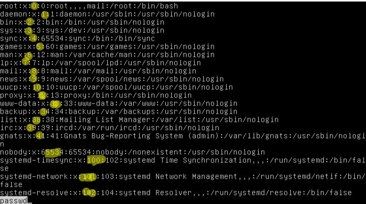 |
|:--:|
| <b> Img. 2.1 - User's identificators.</b> |

3) What is GID? How to define it?
UID is a simple numeric key to identify the group. Group is a union of users that possess identical rights and restrctions.

GID of a specific  can be defined in the file etc/passwd:
| 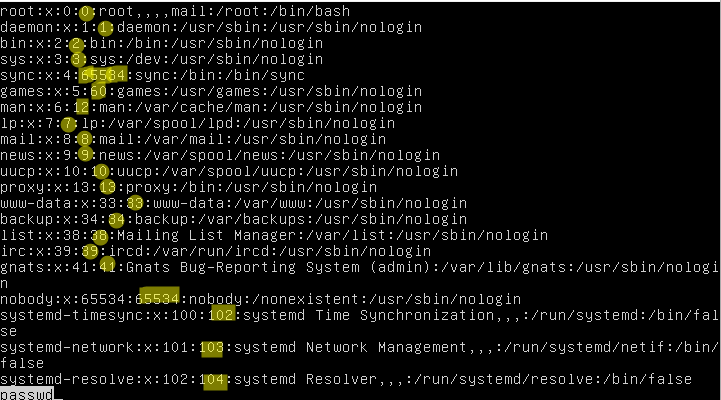 |
|:--:|
| <b> Img. 2.1 - User's identificators.</b> |
All the GIDs are saved in etc/group:
| 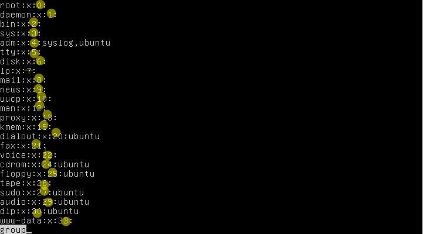 |
|:--:|
| <b> Img. 2.1 - User's identificators.</b> |

4) How to determine belonging of user to the specific group? 

This need can be implemented with command "id":

| 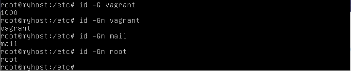 |
|:--:|
| <b> Img. 4.1 - Defining the belonging of user to the specific group.</b> |

***

5) What are the commands for adding a user to the system? What are the basic parameters required to create a user?

There are two commands to crate user:
1. adduser
2. useradd
The first command doesn't create home directory for the user.

Usually, when creating a user several parameters are set up:
-p password
-d directory
-c uid comment
-g gid group_name
-s shell 
-u uid username

***

| 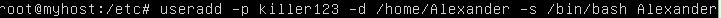 |
|:--:|
| <b> Img. 5.1 - Defining the belonging of user to the specific group.</b> |

| 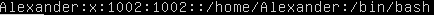 |
|:--:|
| <b> Img. 5.2 - Defining the belonging of user to the specific group.</b> |

6) How do I change the name (account name) of an existing user?

| 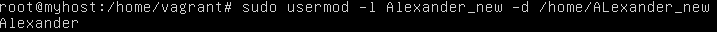 |
|:--:|
| <b> Img. 6.1 - The process of changing username.</b> |

| 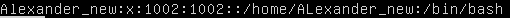 |
|:--:|
| <b> Img. 6.2 - The process of changing username.</b> |

***

7) What is skell_dir? What is its structure?

skel_dir is a directory that contains files which must be copied to the new user's home directory.
The /etc/skel directory contains files and directories that are automatically copied over to a new user’s when it is created from useradd command.

| 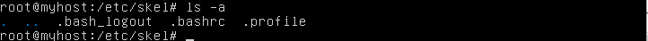 |
|:--:|
| <b> Img. 4.1 - Defining the belonging of user to the specific group.</b> |

***

8) How to remove a user from the system (including his mailbox)?
This operation can be done with the help of "userdel -rf"

| 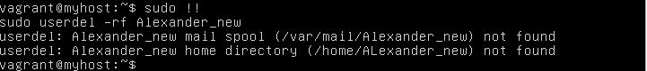 |
|:--:|
| <b> Img. 8.1 - Removing users</b> |

***

9) What commands and keys should be used to lock and unlock a user account?
The example of using usermod --lock/--unlock:
| 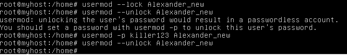 |
|:--:|
| <b> Img. 9.1 - Defining the belonging of user to the specific group.</b> |

***

10) How to remove a user's password and provide him with a password-free login for subsequent password change?

Command "file" can be used to determine type of the file:

| 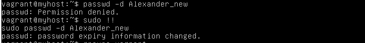 |
|:--:|
| <b> Img. 10.1 - Setting a password-free login.</b> |

***

11) Display the extended format of information about the directory, tell about the information columns displayed on the terminal.

Description of columns:

1) Type of the file and access rights;
2) Quantity of links to the file;
3) Owner;
4) The Main Group when owner is a member;
5) File size;
6) Date when the file was created.
| 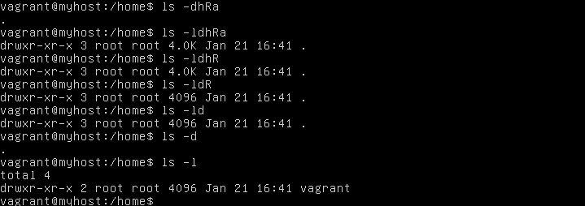 |
|:--:|
| <b> Img. 11.1 - Extended format of information about the directory.</b> |

***

12) What access rights exist and for whom (i. e., describe the main roles)? Briefly describe the acronym for access rights.

***

There are access right for read(r), write(w) and execution(x). Access rights exist for user, group and others. Command "ls -l" is lets you check access right for each file. Command "chmod" lets you change access right by two ways: numerical and symbolic.
Also there are speicific attributes for the file. Such as SUID and SGID.
SUID is an attibute that lets you execute files with rights of an owner of the file.
SUID is set by adding number 4 before initial 3 digits of access rights or by typing "u+s".
"chmod 4777 file" or "chmod u+s file".
SGID is an attibute that lets you execute files with rights of a of the owners of the file.
SUID is set by adding number 2 before initial 3 digits of access rights or by typing "g+s".
"chmod 2777 file" or "chmod g+s file" 

|  |
|:--:|
| <b> Img. 15.1 - Access rights.</b> |

13) What is the sequence of defining the relationship between the file and the user?

Firstly, access for the user (owner) is defined.
Secondly, access for the main group where owner is a member.
Thirdly, for others.

***

14) What commands are used to change the owner of a file (directory), as well as the mode of access to the file? Give examples, demonstrate on the terminal.

| 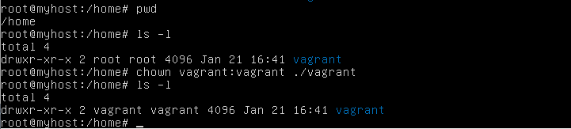 |
|:--:|
| <b> Img. 15.1 - Defining the belonging of user to the specific group.</b> |

***

15) What is an example of octal representation of access rights? Describe the umask command.

Octal representation is a representation when numbers from 0 and 7 are used.
These numbers replace its symbolic meanings. 
For example, the commands "chmod ugo+rwx file1.txt" and "chmod 777 file1.txt" are equal. Because certain numbers match certain letters.
For example:
0 is equal to -rwx;
1 is equal to +x;
2 is equal to +w;
4 is equal to +r.

Thus, these numbers can be in sum to set a combination of rights. 

***

16) Give definitions of sticky bits and mechanism of identifier substitution. Give an example of files and directories with these attributes.
Sticky bit is an additional access right that was made to provide security, namely, to prevent the file from deletion and changing its name. If sticky bit is sut up, only owner and root can change the name of the file and delete the file.

Numeric way to set sticky bit:
| 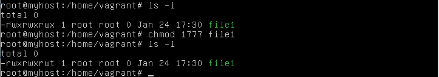 |
|:--:|
| <b> Img. 16.1 - Numeric way to set sticky bit.</b> |

Symbolic way to set sticky bit:
| 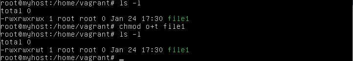 |
|:--:|
| <b> Img. 16.2 - Symbolic way to set sticky bit</b> |
***

17) What file attributes should be present in the command script?

If you want to run the bash-script that has just been created, you need to make the file executable for certain users. In other words, you need to set access rights for execution with the help of chmod.

***