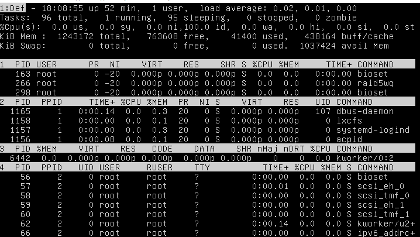

Task1.Part1

***

1) How many states could has a process in Linux?

***
There are 5 states of processes: 

1. Ready - When process was initialized by its parential process and it waits for data to handle;
2. Waiting - when process waits for external events such as input\output, other processes' calls etc. There two types of "Waiting" state: with interrutions and without;
3. Running - when process perform work during a quant of time given to it;
4. Stopped - when work was stopped by system command SIGSTOP. Stopped process will be staying in this state till it'll be sent the command SIGCONT (to continue working) or SIGKILL (to finish working completely). Other signals are moved in the queue.
5. Zombie - when work of a process completed but its memory is still in the kernel.

Process in Linux can have only one state at the same time. 

2) Examine the pstree command. Make output (highlight) the chain (ancestors) of the current process.

***

pstree and pstree username:
|  |
|:--:|
| Picture 2.1 - Output of command pstree. |

"-p" show PIDs, "-g" show PGID
pstree -pg (PIDs will always be showed first)
|  |
|:--:|
| Picture 2.2 - Output of command pstree -pg. |

"-n" sort by PIDs:
 pstree -pn
|  |
|:--:|
| Picture 2.3 - Output of command pstree -pn. |

"-a" show command attributes of process:
|  |
|:--:|
| Picture 2.4 - Output of command pstree -a. |

3) What is a proc file system?
"/proc" is a vitual file sustem that is used to monitor and manipulate processes in the system. This directory is virtual so it doesn't take any place on your hdd. This file system contains in directories that coantain in files that desribe processes of a certain users. Certain user can see only his own processes. Directories' names are match their PIDs.

***

|  |
|:--:|
| Picture 3.1 - Contents of /proc/. |

Files in the directory are file descriptors (in other words, threads of input/output).

4) Print information about the processor (its type, supported technologies, etc.).

The command lscpu is used to display information about the processor:

|  |
|:--:|
| Picture 4.1 - Information about the processor. |

|  |
|:--:|
| Picture 4.2 - Information about the processor. |

***

5) Use the ps command to get information about the process. The information should be as follows: the owner of the process, the arguments with which the process was launched for execution, the group owner of this process, etc. 

***

ps -eo user,args,gid,cmd,pcpu,pmem (without gaps!):
|  |
|:--:|
| Picture 5.2 - Information about the process. |

***

6) How to define kernel processes and user processes?
To check if the process either sytem or user you should use "ps -eo ouid, ruser, pid".
All the system processes started by system has UIDs "-" in the command "ps". 
System processes have RUIDs lower than 1000 and symbol "-".
User's processes have UIDs higher than 1000 and user.

***

7) Print the list of processes to the terminal. Briefly describe the statuses of the processes. What condition are they in, or can they be arriving in?
You can see states of the processes on the picture below, process states are 

***

enlightened by yellow color:
|  |
|:--:|
| Picture 7.1 - Information about the process. |

R means running
S means interrupatbly sleep
T means stopped
Z means zombie
X means dead
D means uninterrupatbly sleep.

***

8) Display only the processes of a specific user. 

***

top -u vagrant:
|  |
|:--:|
|  Picture 8.1 - The processes of a specific user. |

***

9) What utilities can be used to analyze existing running tasks (by analyzing the help for the ps command)?

***

There are several utilities to analyze tasks except ps:

1)top - The command "top" displays information about all the initialized processes in the system, refreshing it during the time.
2)pstree - The command pstree shows the hierarchy of the processes in the shape of a tree so you can see all the dependeces among the processes.
3)htop - This command represents a child of the "top" command with some improvements. 
4)atop - this program is the most advanced version of the "top" command. It also can show you the statistics of using your hard drive and network.

top:
|  |
|:--:|
| Picture 8.1 - The processes of a specific user. |

pstree:
|  |
|:--:|
| Picture 8.1 - The processes of a specific user. |

htop
|  |
|:--:|
| Picture 8.1 - The processes of a specific user. |

atop:
|  |
|:--:|
| Picture 8.1 - The processes of a specific user. |

|  |
|:--:|
| Picture 8.1 - The processes of a specific user. |

***

10) What information does top command display?

***

The command "top" displays information about all the initialized processes in the system, refreshing it during the time.

|  |
|:--:|
| Picture 10.1 - The "top" command. |

PID - Process ID
USER - name of a user this process belongs to
PR - priority
NI - Nice value (priority)
VIRT - Virtual memory size. All the memory (physical and swap,) is used by the task. It can include data, code, external libraries, swap, etc.
RES - Resident memory. All the physical memory dedicated to the process.
SHR - Shared Memory. All the memory that can be potentially shared without damage to the process.
S - process state. S interrupatbly sleep, R means running.
%CPU - percent of the processor's time spent on the process during certain fixed period.
%MEM - percent of the system's memory dedicated to the process.
TIME+ - total amount of real time the processor spent on the process.
COMMAND - shows the command that started the process.

***

11) Display the processes of the specific user using the top command.
Lets see the process that belong to the user with the name "vagrant". It can be done by such a command "top -u vagrant":

***

|  |
|:--:|
| Picture 11.1 - The processes of a specific user. |
attribute l

***

12) What interactive commands can be used to control the top command? Give a couple of examples.
type "z" to change the color to red.

***

|  |
|:--:|
| Picture 12.1 - Changing the color of the command. |
type "shift+a" to split the screen into 4 separated little sreens:

|  |
|:--:|
| Picture 12.2 - Splitting screens into 4 parts. |

type "f" to set shown parameters and to set current sort field:
d - include/exclude the paramener to the shown.
a - select the screen to change the list of parameters for multi-screen mode
s - set the sort field.

|  |
|:--:|
| Picture 12.3 - The "Settings" menu. |

***

13) Sort the contents of the processes window using various parameters (for example, the amount of processor time taken up, etc.)
sorted by the amount of time taken up to the processor:

***
Sorted by %CPU:
|  |
|:--:|
| Picture 13.1 - Sorting by %CPU. |

sorted by PID:
|  |
|:--:|
| Picture 13.2 - Sorting by PID. |

sorted by NI (nice priority)
|  |
|:--:|
| Picture 13.3 - Sorting by NI. |

***

14) Concept of priority, what commands are used to set priority?

Priority is a relative parameter that means the cpu time that is dedicated to the process relatively to others. The higher pririty the more cpu time is taken up by the process and the faster the program works.
Nice is used to set the priority for tasks that haven't been started yet.
Renice is used to change the pririty for tasks that have already been started.

Run the top command with the priority 9:
nice -n 9 top

|  |
|:--:|
| Picture 14.1 - Checking the pririty of the process. |

Now let's change the priority for the process with PID 4979:
renice -n 9 -p 4979

|  |
|:--:|
| Picture 14.2 - Changing the pririty of the process. |

|  |
|:--:|
| Picture 14.3 - Changing the color of the command. |

***

15) Can I change the priority of a process using the top command? If so, how?

You can change the priority using the top command. To do it, run the top, press r and type the PID of a process you want to change the pririty, then press Enter, type the nice value and press Enter.

|  |
|:--:|
| Picture 15.1 - Checking the pririty of the process. |

|  |
|:--:|
| Picture 15.2 - The process of changing the pririty of the process by "top" command. |

***

16) Examine the kill command. How to send with the kill commandprocess control signal? Give an example of commonly used signals.

There are 64 different kill commands. You look them up using kill -l.
Also there are 3 ways of typing kill control signals:
using numbers of signals
using prefix "SIG" with command
without using prefix "SIG"

For example, let's restart the process with PID 4979 by 3 ways:
kill -1 4979
kill -SIGHUP
kill -HUP

|  |
|:--:|
| Picture 16.1 - Testing the command. |

The most common uses of the kill command is to reload the process (-1), to force stop the process (-9) and to terminate the process (-15).

|  |
|:--:|
| Picture 16.2 - The most common uses of the kill command. |

***

17) Commands jobs, fg, bg, nohup. What are they for? Use the sleep, yes command to demonstrate the process control mechanism with fg, bg.
jobs shows you all the processes in the background
fg switches the process in foreground
bg switches the process in the background
The example of using these three commands:

|  |
|:--:|
| Picture 17.1 - Using the bg and fg commands. |

nohup is the command that lets you start a process that will work in the background even if its user is logged out from the system.
The example of using nohup:
|  |
|:--:|
| Picture 17.2 - Using the nohup command. |

***

Part 2

1) Check the implementability of the most frequently used OPENSSH commands in the MS Windows operating system. (Description of the expected result of the commands + screenshots: command – result should be presented)

|  |
|:--:|
| Picture 18.1 - Connecting via ssh in powershell. |

|  |
|:--:|
| Picture 18.2 - Connecting via ssh in MobaXTerm. |

***

2) Implement basic SSH settings to increase the security of the client-server connection

It's recommended to set additional security settings of the ssh connection. To do it - edit the file /etc/ssh/sshd_config. Set the second version of this protocol, and set the authentication only with rsa-key:

|  |
|:--:|
| Picture 19.1 - Editing the file /etc/ssh/sshd_config. |

|  |
|:--:|
| Picture 19.2 - Editing the file /etc/ssh/sshd_config. |

Now let's logout and generate the ssh-key we are going to send to the remote machine. We will use the "scp" command to send the file to the remote machine via ssh.
|  |
|:--:|
| Picture 19.3 - Generating ssh-key, using the "scp" command. |

Now let's move the key to the certain directory.

|  |
|:--:|
| Picture 19.4 - Moving the file. |

Now let's check changes. To do it, we need to logout and login again:

|  |
|:--:|
| Picture 19.5 - Testing the work. |

***

3) List the options for choosing keys for encryption in SSH. Implement 3 of them.

You can look up the option to the ssh-keygen command using "man ssh-keygen":
|  |
|:--:|
| Picture 20.1 - The list of the options for the "ssh" command. |

It isn't the complete list, the rest of the options is hidden below the screen.

Let's try out some options:

Let the type of the key be ecdsa.
ssh-keygen -t ecdsa:
|  |
|:--:|
| Picture 20.2 - Changing the type of the key. |

Let the option "port-forwarding" be enabled.
ssh-keygen -O permit-port-forwarding:
|  |
|:--:|
| Picture 20.3 - Permitting port-forwarding. |

Let the size of the key be 1024.
ssh-keygen -b 1024:
|  |
|:--:|
| Picture 20.4 - Changing the size of the key. |

***

4) Implement port forwarding for the SSH client from the host machine to the guest Linux virtual machine behind NAT.
It can be done with the option "-L" in the ssh command. This command allows you to set the forwarded port. Let's pick the port 4000 as the forwarded one.
But we need some data that is forwarded through the port to make sure that it works. Let's make a web-server of our remote computer. Such a program as apache is required.

To install the apache, enter the following command:
sudo apt-get install apache2.
After that you are able to move to the /var/www/html/ and create your html-page that contains in simple code. For example:
|  |
|:--:|
| Picture 21.1 - Creating the html-page. |

Let check if the apache works. On your local machine type in the browser's searchline the address of your remoter server. If everything works, you'll see your html-page:
|  |
|:--:|
| Picture 21.2 - Checking the corectness. |

Now let's use the option "-L" and "-N" in our ssh-command. The option -N means do not execute the command. This is useful for just forwarding the port.
|  |
|:--:|
| Picture 21.3 - Providing port-forwarding. |

And let's connect to the server through the port 4000 to our server. Type "localhost:4000" in the searchline of your web-browser.
|  |
|:--:|
| Picture 21.4 - Checking if everything works. |

***

5) Intercept (capture) traffic (tcpdump, wireshark) while authorizing the remote client on the server using ssh, telnet, rlogin. Analyze the result.

The connection via ssh:

|  |
|:--:|
| Picture 22.1 - Using "tcpdump" command. |

-v show more information
-i set the interface to "listen"

From this command we can see the protocol of the packet, time when the packet was received/sent, the length of the packet, the addresses of sender and receiver, ttl (time to live) of the packet, the offset of the bytes, name of the dns-server, id of the packet.
Usually, this information is enough. For further information we can use the options -vv or even -vvv.

The command "telnet" works using the telnet protocol. This command is enable you to get answers from the server to your HTTP-requests. For example, let's make one of the simplest requests to take the page index.html:

|  |
|:--:|
| Picture 22.1 - Using "tcpdump" command. |

The command "rlogin" is the command that is used to connect to the remote computer. In other words this this the analog of the command "ssh" that we've already experienced above:
|  |
|:--:|
| Picture 22.1 - Using "tcpdump" command. |

Analyzing tcpdump, we can make the conclusion that we get similar packet form each of the utility. The main difference is in protocols these cammands use. Thus, telnet uses telnet protocol, ssh uses the ssh protocol and rlogin uses rlogin.
