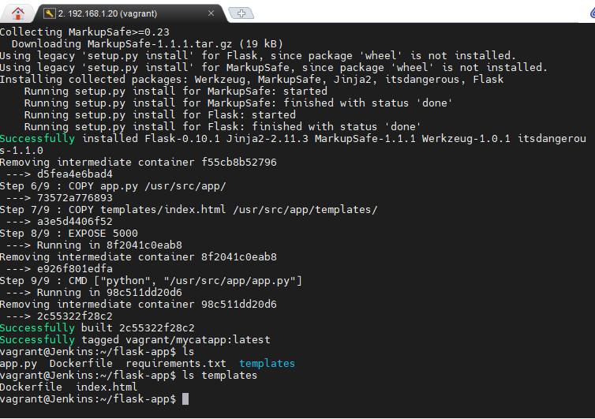

Docker task description.  
Using docker lection 2 create a docker image with Python Flask app that displays random cat pix. 

It's essential to point out that after installation and performing all the necessary commands to launch docker container we faced problem of permissions. The matter is that we couldn't run docker container despite being member of docker group. We can see it on the Picture 1.

|  |
|:--:|
| Picture 1 - Checking java on our server. |

The solution to this problem turned out to be unexpected. We just need to reconnect to VM to resolve this problem. The command displays errer but this new error is connected to previously launched docker container:

|  |
|:--:|
| Picture 2 - Checking java on our server. |

Now let's create a container that contains in web-site with gifs that are randomly pulled from another site. To create such a project we need to create files, such as: Dockerfile to launch the container, index.html to show gifs, app.py to perform random pulling, and requirements.txt to tell python to download flask (pip).
The contant of the files will be the following:

|  |
|:--:|
| Picture 3 - The content of app.py. |

|  |
|:--:|
| Picture 4 - The content of Dockerfile. |

|  |
|:--:|
| Picture 5 - The content of index.html. |

The contant of file requirments.ru is the only string "Flask==0.10.1".

Now we can build docker container to run the site.

|  |
|:--:|
| Picture 6 - The process of building of our container. |

|  |
|:--:|
| Picture 7 - The process of building of our container. |

After building we can use the command docker run to lauch the container. After launching we can see random gifs from the list.

|  |
|:--:|
| Picture 8 - Checking if the flask-app works. |

|  |
|:--:|
| Picture 9 - Checking if the flask-app works. |

