Alexander Stepanov, Task 2.1

PART 1. HYPERVISORS

1.What are the most popular hypervisors for infrastructure virtualization?

There are three the most popular programs for virualization: Microsoft Hyper-V, Oracle VirtualBox and VMWare Workstation.

2.Briefly describe the main differences of the most popular hypervisors.

Microsoft Hyper-V is provided in all versions of Windows since Windows 7.
It was created to work mostly with Windows systems so that it isn't recommended to use Linux systems with this programs due to some problems with compatibility.

VirtualBox is a free and a quite simple application. It can be used with all popular systems, such as: Windowsm Linux, Mac. This program is enable to make screenshots, clone machines. Also this programs lets you provide networking to your virtual machines.

It is said that VMware is better to deploy servers for fulltime. This program is enable to create a FireWall that gives you an opportunity to separate your network from the Internet. You must pay for this program first before using it.

***

PART 2. WORK WITH VIRTUALBOX

1.First run VirtualBox and Virtual Machine (VM).
1.1 Get acquainted with the structure of the user manual VirtualBox.

***

1.2 From  the  official  VirtualBox  site  [2]  download  the  latest  stable  version  of VirtualBox  according  to  the  host  operating  system  (OS)  installed  on  the  student's workplace. Download the latest stable version of Ubuntu Desktop or Ubuntu Server from the official site.

***

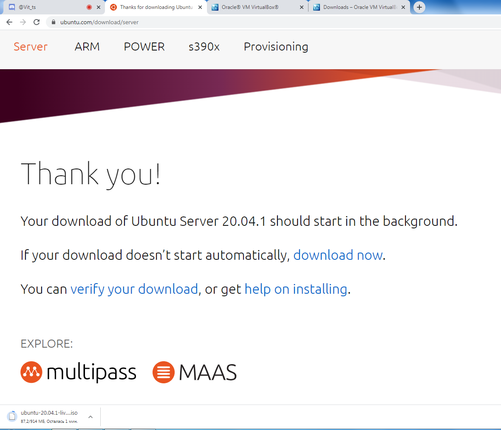

***

1.3-1.7 Create VM1 and install Ubuntu using the instructions [1, chapter 1.8]. Set machine name as "host machine name"_"student last name".
Get acquainted with the possibilities of VM1 control -start, stop, reboot, save state, use Host key and keyboard shortcuts, mouse capture, etc.
Clone an existing VM1 by creating a VM2.
Create a group of two VM: VM1, VM2 and learn the functions related to groups.

***

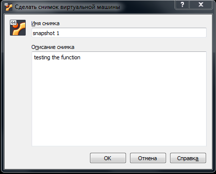
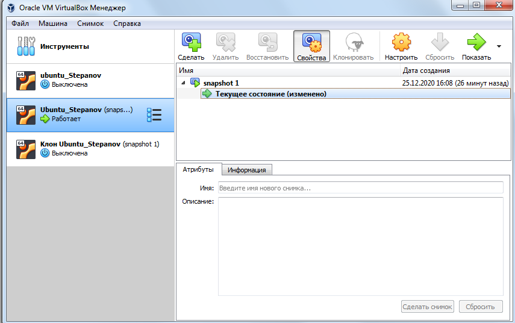
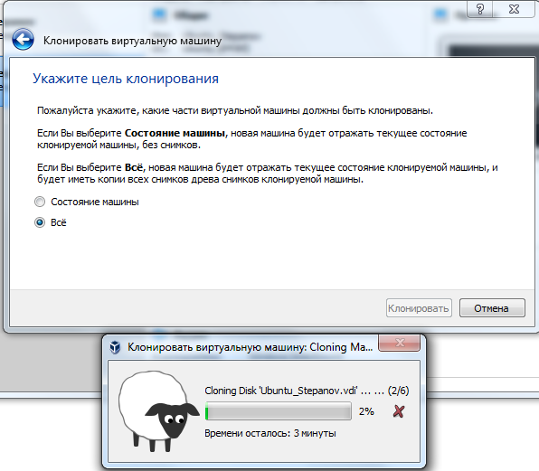
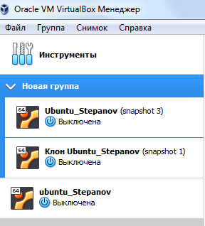

***

1.7 For VM1, changing its state, take several different snapshots, forming a branched tree of snapshots.

***

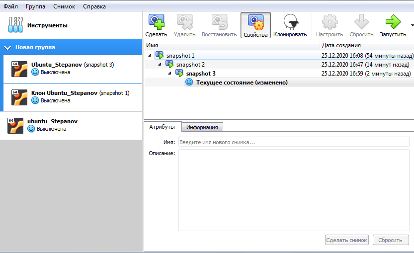

***

1.8 Export VM1. Save the *.ova file to disk. Import VM from *.ova file.

***

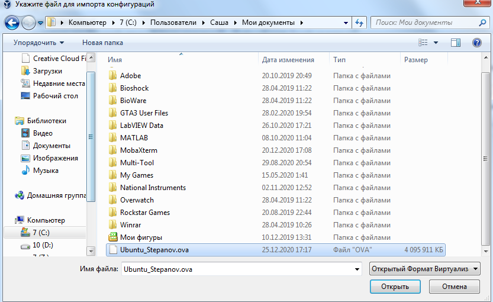
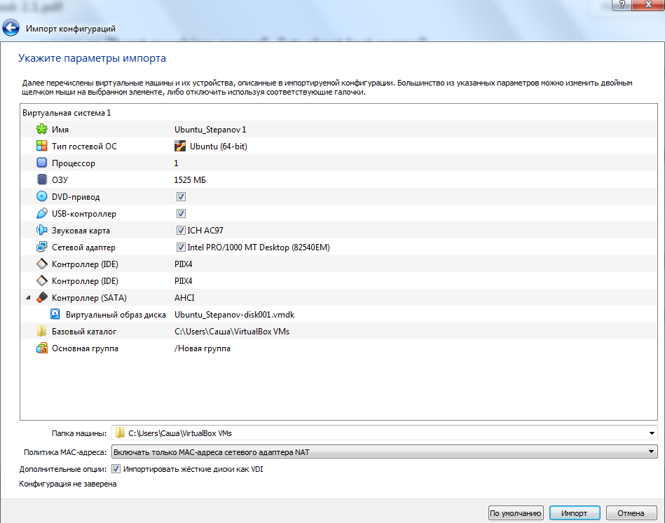
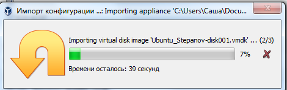
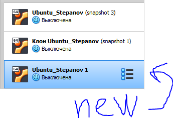

***

2.Configuration of virtual machines
2.1 Explore VM configuration options (general settings, system settings, display, storage, audio, network, etc.).
2.2 Configure the USB to connect the USB ports of the host machine to the VM.

***

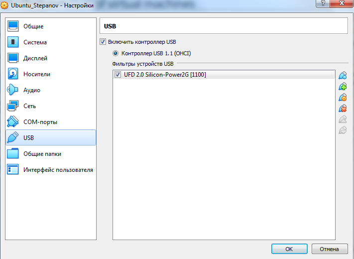
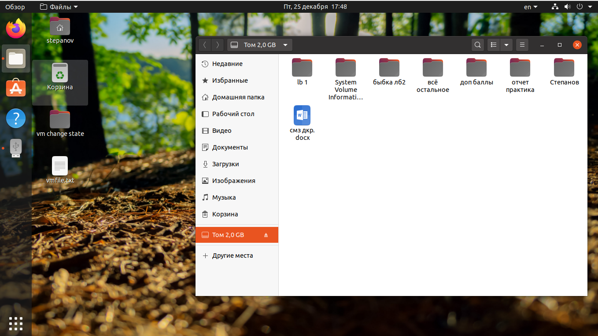

***

2.3 Configure a shared folder to exchange data between the virtual machine and the host

***

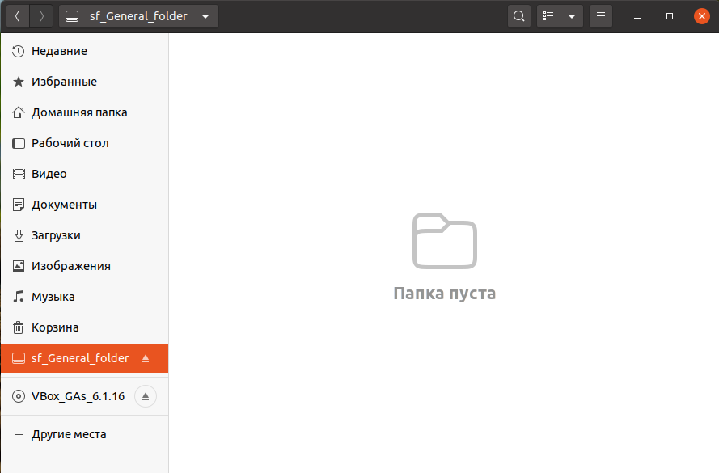

***

3.Work with CLI through VBoxManage.
3.1. Run the cmd.exe command line.

***

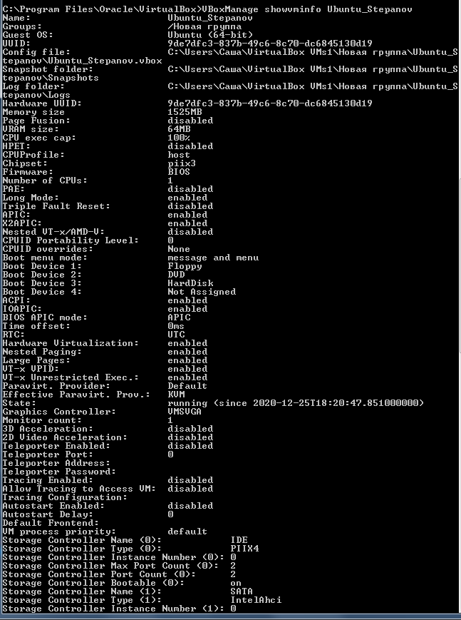
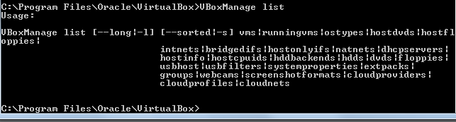
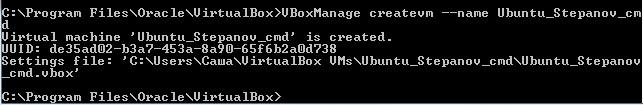
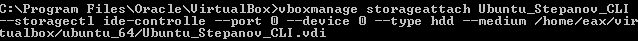
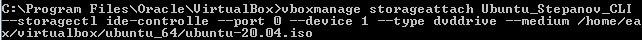
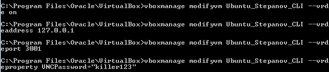
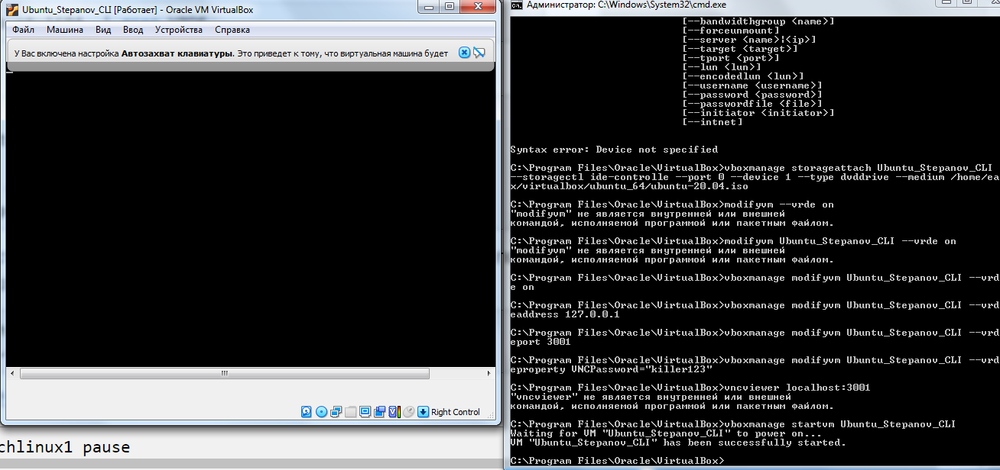
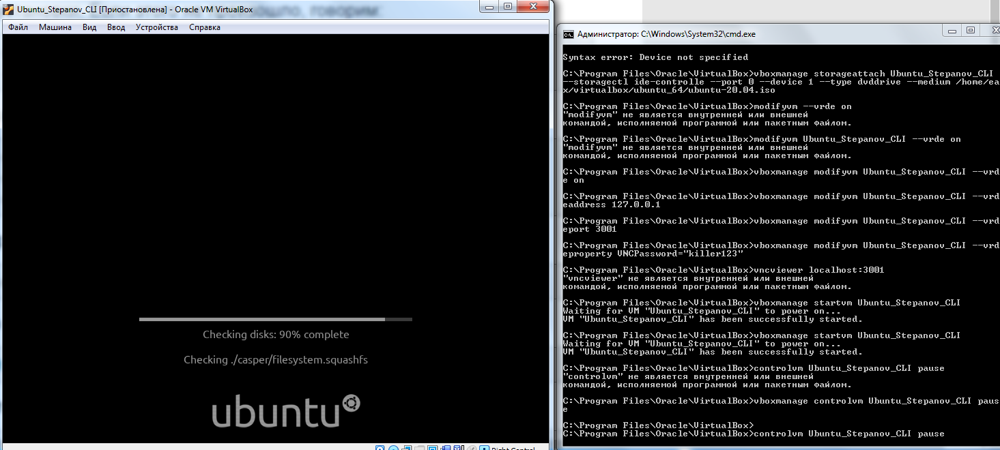
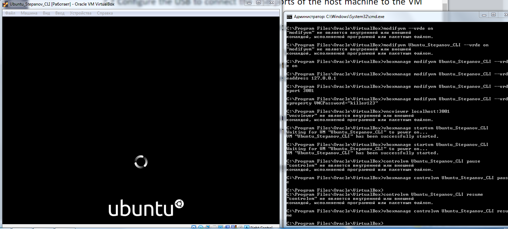
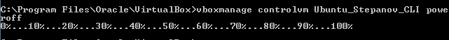
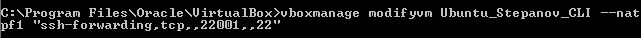
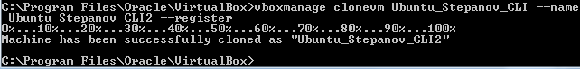

***

PART 3. WORK WITH VAGRANT 
1.Download the required version of Vagrant. 
2.Run the powershell. Create a folder "student name" (in English). In this example, create a folder vagrant_test. Next, go to the folder.
3-8. Create your own Vagrant box.

***

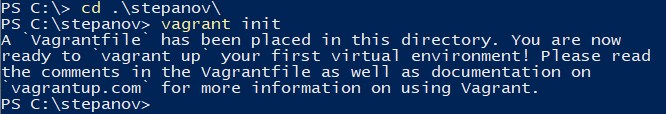
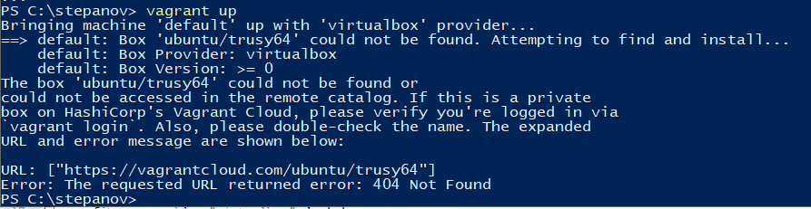
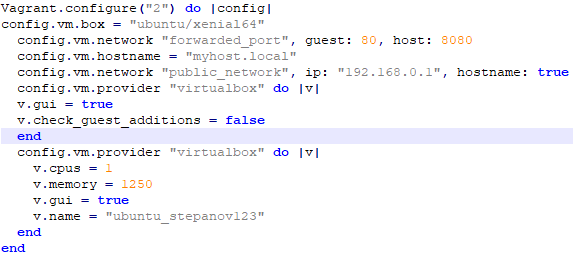
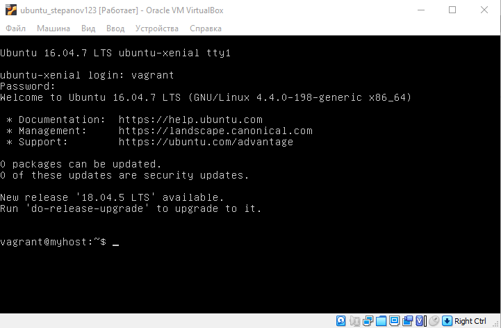