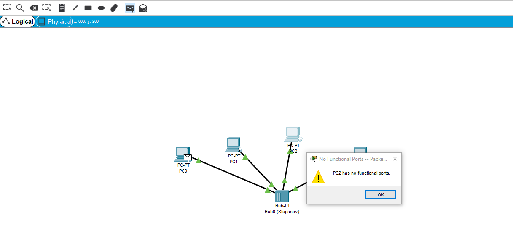

Alexander Stepanov, Task 2.1

## EPAM University Programs  
## DevOps external course  
## Module 4 Networking Fundamentals  
#### TASK 4.1   

1. Зібрати проект, який містить в собі: 4 ПК типу PC-PT, Концентратор(Hub-PT). Кожен  комп'ютер  повинен  бути  з'єднаний  з концентратором за допомогою крученої пари (CopperStraight-through).  

Даний проект та наступні проекти будуть збиратися у середовищі Cisco Packet Tracer версії 7.1.3.

2. Зберегти проект і його скріншот.

Зберігання проекту відбувається за допомогою кобінації клавіш Ctrl + S.

|  |
|:--:|
| Рисунок 1 -  Створення та збереження проекту. |

3. Кожному  ПК  привласнити  унікальну IP  адресу.  Для її призначення необхідно  зайти  в меню  конфігурації ПК  шляхом  одноразового клацання  по ньому  лівою  кнопкою  миші  і  вибору  вкладки  Config  /  Interface.  В  полі ip address необхідно ввести відповідну адресу, а вполі Subnet Mask - відповідно цьому адресу маску.

Значення IP адреси для кожної машини:  
PC0 | 192.168.0.1  
PC1 | 192.168.0.2  
PC2 | 192.168.0.3  
PC3 | 192.168.0.4

Значення маски для адреси: 255.255.255.0.4

|  |
|:--:|
| Рисунок 2 -  Присвоєння комп'ютеру ІР-адреси та маски. |

4. Перевірити  працездатність  отриманої  мережі  шляхом  здійснення Інтернет  запитів  (ICMP  пакетів)  від  одного  ПК  до  іншого.  Для  присвоєння такого пакета ПК використовуйте кнопку ADD SIMPLE PDU в правій частині робочого  вікна.  Після  цього  клацніть  лівою  кнопкою  миші  на  локальну машину-джерело, потім -на машину-одержувача. Перевірити працездатність мережі.

На даний момент інформація дещо застаріла, тому що кнопка ADD SIMPLE PDU була переміщена у ліву верхню частину екрану.

|  |
|:--:|
| Рисунок 3 -  Нове місце розміщення панелі дій, включаючи ADD SIMPLE PDU. |

5. Перейти  в  режим Simulation і  за  допомогою  кнопки Event List викликати вікно відображення подій в мережі Simulation Panel.Використовуючи  кнопку  Auto  Capture  /  Play  запустити  симуляцію роботи  ICMP  пакетів.  Простежити  просування  пакетів  по  мережі  і  зберегти даний скріншот.

Для перевірки було вирішено відправити пакет від РС0 до РС2. Під час цього процесу були передані такі пакети:  
1) Спочатку пакет від комп'ютера РС0 до концентратора.

|  |
|:--:|
| Рисунок 4 - Просування  пакетів  по  мережі. |

2) Потім від концентратора (повторювача) пішли пакети до усіх інших комп'ютерів. Комп'ютери отримали пакет та проаналізували, чи був він відправлений саме до цього компьютера. Якщо це не так - пакет видаляється (це трапилося в комп'ютерах РС1 та РС3). А якщо так - пакет приймається (це трапилось в РС2).

|  |
|:--:|
| Рисунок 5 -  Просування  пакетів  по  мережі. |

3) РС2 відправив відповідь на дане повідомлення. Пакет спочатку проходить крізь повторювач.

|  |
|:--:|
| Рисунок 6 -  Просування  пакетів  по  мережі. |

4) Повторювач відправляє даний пакет усім інших комп'ютерам окрім РС2, ті в свою чергу перевіряють, чи був пакет відправлений саме їм. РС0 підтвердив, що пакет був відправлений саме йому (стоїть галка), інші видалили пакет (стоїть хрестик).  

|  |
|:--:|
| Рисунок 7 -  Просування  пакетів  по  мережі. |

6. Простежити  за  порядком  і  шляхом  проходження  пакетів  у  вікні Simulation Panel (рис. 3). Зберегти даний скріншот.

Процес проходження пакету по мережі вже був розлянутий у попередньому пункті.

7. Переглянути інформацію о пакетах з вікна Simulation Panel і їх відповідність моделі OSI шляхом подвійного клацання по пакету в вікні. Результати зберегти як скриншот.

Для аналізу був обраний пакет, який дійшов від концентратора до РС2, його час визначений як 0.003.

Тут були отримані доволі неочікувані результати. Справа у тому, що концентратори зазвичай працюють тільки на фізичному рівні. Вони не стежать за адресами пакетів, не розуміють, де початок, а де кінець пакету, який протокол пакету і так далі. Але згідно з меню PDU Iformation Device були отримані дані, що пакет знаходиться на третьому рівні моделі OSI (мережному). Це можна пояснити тим, що ця панель дає інформацію про сам пакет, а не про те, як його бачить сам пристрій (концентратор). Бо сам пакет типу ICMP відноситься до третього рівня. 

|  |
|:--:|
| Рисунок 8 - PDU Iformation Device nf Simulation Panel. |

8. Видалити  IP  адреса  з  кожною  локальною  машини  PC0-PC3. Повторити пункти 5-10. Проаналізувати відмінності в роботі мережі.

Після видалення адрес з кожного компьютера, мережа перестала функціонувати.

|  |
|:--:|
| Рисунок 9 -  Мережа без ІР-адрес. |

9. Зібрати наступний проект. У нього входять: PC0-PC5, Server, 2  Hubs.  Однойменні  пристрої  з'єднуються  за  допомогою  кросового  кабелю (Copper Cross-over).

|  |
|:--:|
| Рисунок 10 -  Проект, у який входять PC0-PC5, Server, 2  Hubs. |

10. Кожному мережному компоненту привласнити IP адресз наступної таблиці:  
PC0              |      192.168.0.1  
PC1              |      192.168.0.2  
PC2              |      192.168.0.3  
PC3              |      192.168.0.4  
PC4              |      192.168.0.6  
PC5              |      192.168.0.7  
Server           |      192.168.0.5

Значення маски для адреси: 255.255.255.0.

|  |
|:--:|
| Рисунок 11 -  Привласнення ІР-адреси. |

11. Перевірити працездатність мережі.

Для перевірки працездатності пакет був відправлений від РС1 до Сервера.

Система з топологією 2 працює за таким же самим принципом, як і система з топологією 1. Варто відмітити, що у кінці пакет-відповідь був прийнятий тільки компьютерами, підключеними до повторювача зліва тому що інші комп'ютери вже прийняли це пакет крок раніше. Тобто вони вже встигли відкинути цей пакет, поки він йшов до іншої групи комп'ютерів.

|  |
|:--:|
| Рисунок 12 -  Перевірка працездатності. |

12. Створити  новий  проект,  який  включає  в  себе:  4  ПК  типу  PC-PT, Комутатор    (Switch).    Кожен    комп'ютер    повинен    бути    з'єднаний    з концентратором  за допомогою  крученоїпари  (Copper  Straight-through).

Цій пакет в цілому такий же як і в топології 1. Тільки замість концентратора використовується комутатор. Це вплине на принцип роботи мережі. 

|  |
|:--:|
| Рисунок 13 -  Топологія 3. |

13. Для   даної   топології   повторити   пункти   3-9.   Проаналізувати відмінності в роботі мережі Топології 1 і Топології 3.

Завдяки тому, що комутатор здатен аналізувати потік даних, помічати, де знаходится флаги (початок та кінець) пакету, робити адресацію (завдяки веденню таблиці), сама мережа стає менш навантаженою зайвими пакетами, пакети передаються безпосередньо до компь'ютера з ІР-адресою отримувача, яка вказана у самому пакеті. Комутатор відправляє пакет усім комп'ютерам тільки, якщо:  
1) Пакет широкомовний
2) Комутатор не має адреси одержувача у своєї таблиці.

|  |
|:--:|
| Рисунок 14 -  Перевірка роботи мережі. |

14. Розширити проект до такого вигляду . У нього входять: 8 ПК типу PC-PT, 2 комутатори (Switch). Кожен комп'ютер повинен бути з'єднаний з   комутатором   за   допомогою   крученоїпари   (Copper   Straight-through), комутатори  між  собою з'єднуються  за допомогою кросового кабелю (Copper Cross-over).

|  |
|:--:|
| Рисунок 15 -  Топологія 4 . |

15. За необхідністю додати  додаткові  порти  на  комутатори.  Для  цього необхідно  у  вкладці  Physical  /  MODULES  кожного  з  них  перетягнути доступний порт Ethernet в порожнє гніздо, попередньо вимкнувши комутатор за допомогою кнопки вимкнення.

У нашому випадку це не знадобилося, так як був використаний комутатор "2950-24", але візуально це робиться таким чином:
1) Обов'язково вимикаємо комутатор.  
2)Натискамо на назву потрібного порта лівою кнопкою миші та невідпускаючи кнопку перетаскуємо до порожнього гнізда у комутаторі.  
3) Вмикаємо комутатор.

|  |
|:--:|
| Рисунок 16 -  Додавання портів до комутатора. |

16. Кожному мережному компоненту привласнити IP адресз наступної таблиці:  
PC0 | 192.168.0.1  
PC1 | 192.168.0.2  
PC2 | 192.168.0.3  
PC3 | 192.168.0.4  
PC4 | 192.168.0.5  
PC5 | 192.168.0.6  
PC6 | 192.168.0.7  
PC7 | 192.168.0.8  

Значення маски для адреси: 255.255.255.0.

17. Перевірити працездатність мережі. 

Дана мережа працює за таким же принципом, за яким працює і її "зкорочений" варіант. Ніяких звйвих пакетів, які потім будуть лише видалятися іншими компьютерами.

|  |
|:--:|
| Рисунок 17 -  Перевірка працездатності мережі. |

18. Існуючу  мережу  розбити  на  дві  рівні  підмережі.  І  з'єднати  їх  за допомогою   маршрутизатора   Router-PT   з   декількома   портами   (рис.   8). Маршрутизатор і комутатори з'єднати між собою за допомогою оптоволокна (Fiber).

|  |
|:--:|
| Рисунок 18 -  Мережа з топологією 5. |

19. Комп'ютерам РС4–РС7 привласнити  IP  адреси  з  наступної таблиці:  
PC4 | 192.168.1.1  
PC5 | 192.168.1.2  
PC6 | 192.168.1.3  
PC7 | 192.168.1.4  
Значення маски залишається колишнім: 255.255.255.0.

|  |
|:--:|
| Рисунок 19 -  Присвоєння ІР-адреси. |

20. Порти  маршрутизатора  слід  включити  (On)  і  призначити  їм  IP адреси в діапазоні обраної підмережі.

Для включення інтерфейсу роутера потрібно натиснути на роутер лівою кнопкою миші, обрати вкладку "Config", у списку, що з'явився, обрати інтерфейс, який ми бажаємо включити, та поставити галку біля слова "On".

|  |
|:--:|
| Рисунок 20 -  Включення портів маршрутизатора. |

21. На кожному з комп'ютерів (РС0-РС7) необхідно позначити шлюз. Для  його призначення  необхідно  зайти в  меню  Desktop  /  Ip  Configuration і  в полі  Default  Gateway  ввести  адресу  порту  маршрутизатора,  через  який  до нього підключається підмережа, що включає даний ПК.

|  |
|:--:|
| Рисунок 21 -  Налаштування шлюза. |

22. Перевірити працездатність мережі.23. Проаналізувати відмінності в роботі мережі Топології 4 і Топології 5. Оцінити можливості, які дає використання маршрутизатора.

Тут маршрутизатор дозволяє передавати пакети між окремо створеними мережами.
Взагалі, маршрутизатори були створені для того, щоб забезпечити передачу даних між окрамими мережами, незважаючи на тип та принцип передачі даних (наприклад, у першій одній мережі технологія передачі - Ethernet, а у другій - Wi-Fi). Також роутер дозволяє виконувати такі функції, як заборона окремих адрес, заборона трафіку від певних комп'ютерів, створення "віртуалних локальних мереж" та інші функції, пов'язані з безпекою.

|  |
|:--:|
| Рисунок 22 -  Перевірка роботи мережі. |