EPAM University Programs  
DevOps external course  
Module - NetworkingFundamentals  
TASK 4.2  
Завдання 1. Необхідно змоделювати корпоративну мережу організації, яка містить 2  будинки  по  2  поверхи  в  кожному.  Горизонтальна  підсистема  поверху складається з однієї робочої групи по 5 комп'ютерів.Провести аналіз працездатності мережі і її трафіку.

Для реалізації цього завдання були використані два комутатори та двадцять комп'ютерів (по п'ять на одну групу).

| 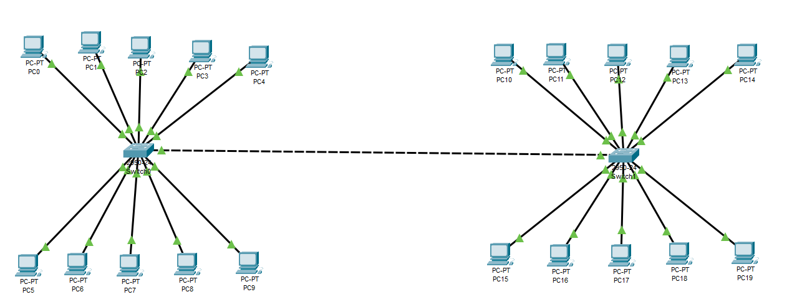 |
|:--:|
| Рисунок 1 - Топологія завдання 1. |

Аналіз працездатності показав, що при підключенні комп'ютерів до комутаторів, присвоєння комп'ютерам ІР-адрес та масок, самі комп'ютери можуть передавати пакети до будь-якого відділення, треба знати тільки точну ІР-адресу.

| 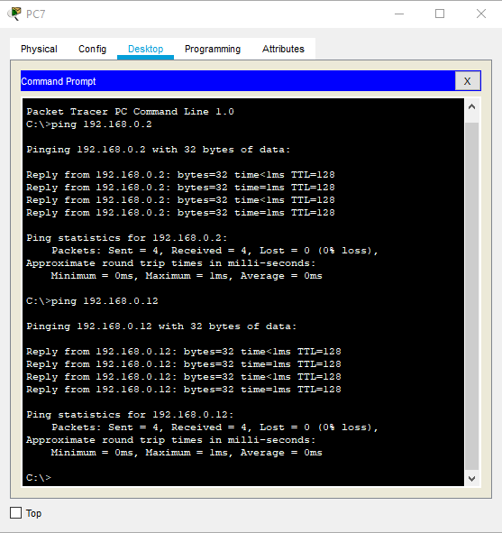 |
|:--:|
| Рисунок 2 - Перевірка працездатності. |

Завдання 2. Необхідно змоделювати корпоративну мережу організації, яка містить 1  будинок  з  чотирма  поверхами.  Горизонтальна  підсистема  поверху складається з двох робочих груп по 3 і 5 комп'ютерів відповідно.Провести логічну структуризацію мережі на 8 підмереж (відповідно до  кількості  робочих  груп).  Провести  аналіз  працездатності  мережі  і  її трафіку.

Логічна структуризація мережі на підмережі має на увазі під собою розділення мережі на певні групи, які не мають доступа один до одного, завдяки програмним засобам. До таких засобів можна віднести VLAN. VLAN налаштовується у комутаторі. Налаштування проводиться такими етапами:
1) Спочатку створюється VLAN, йому задаються опції (зазвичай обходяться тільки його назвою)
2) Потім налаштовується порт комутатора. Налаштовується тип трафіку та сам порт призначається до певного VLAN. Трафік з цього порту доходитеме тільки до портів, яку віднесені то того ж VLAN.

На практиці це виглядає таким чином:

| 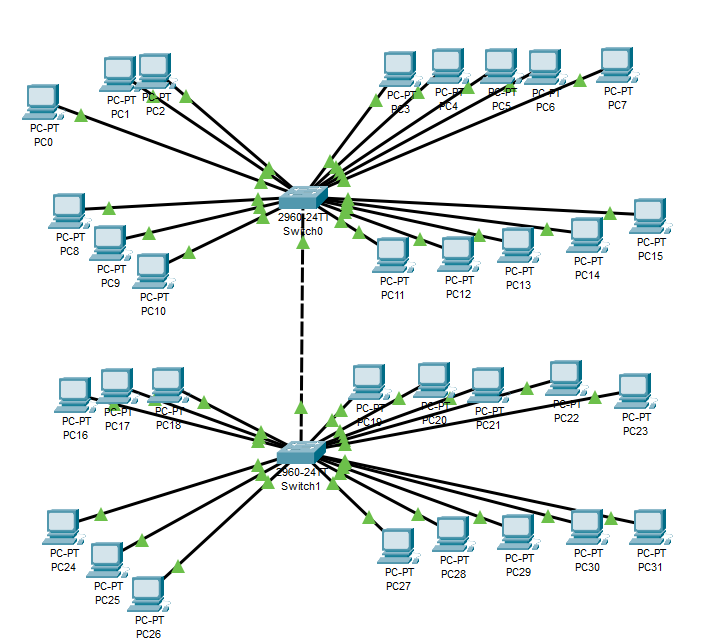 |
|:--:|
| Рисунок 3 - Топологія 2. |
Налаштування VLAN проходить таким чином:  
1) Завдяки програмному забезпеченню постачальника комутатора, отримуємо доступ до командної строки операційної системи комутатора.  
2) Заходимо у режим конфігурування, попередньо прописав команду "en" або "enable".
3) Створюэмо VLAN, просто написавши його порядковий номер. Наприклад, vlan 2.   
4) Задається параметр назви VLAN "name".
5) Потім обираються та налаштовуються порти (зазвичай вказується режим роботи та належність до певного VLAN).

Наприклад, якщо ми хочемо створити VLAN 2 та внести до нього комп'ютери, які підключені до портів комутатора FastEthernet 0/1 та FastEthernet 0/2, потрібно ввести в комутатор такі команди:

en  
vlan 2  
name department_one  
exit  
interface FastEthernet 0/1  
switchprot mode access  
switchport access vlan 2   
exit  
interface FastEthernet 0/2  
switchprot mode access  
switchport access vlan 2   
exit  

Дана процедура зображена на рисунку 4:

| 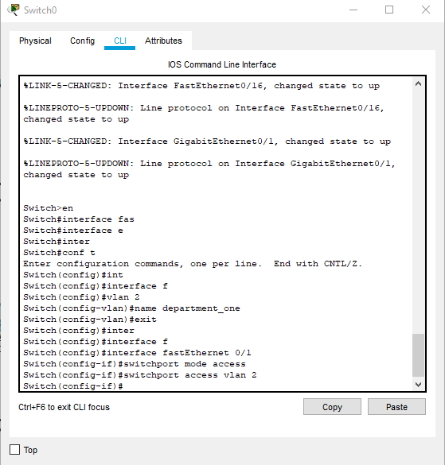 |
|:--:|
| Рисунок 4 - Налаштування VLAN у комутаторі. |

Перевірити правильність кофнігурування можна командою "show vlan". Ця команда покаже надлишкову інформацію, яка наврядчи буде необхідна, тому можна обійтися командою "show vlan brief":

| 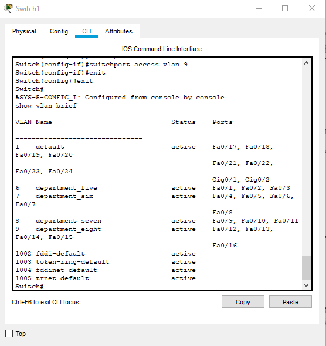 |
|:--:|
| Рисунок 5 - Перевірка налаштувань. |

Варто відмітити, що після процесу конфігурування VLAN та потрыбного порту, буде потрібен дейякий час для того, щоб конфігурування завершилося. Про це може свідчити індикатор підключення, який після включення був зелений, але після прописання команд вище, став помаранчевим:

| 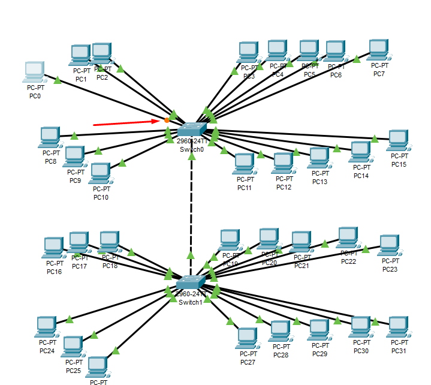 |
|:--:|
| Рисунок 6 - Індикація зміни конфігурації порта комутатора. |

Залишилося тільки присвоїти комп'ютерам статичні ІР-адреси для завершення структуризації мережі. Для цього можна натиснути на комп'ютер лівою кнопкою миші, обрати вкладку "config", та обрати додаток "IP Configuration".

| 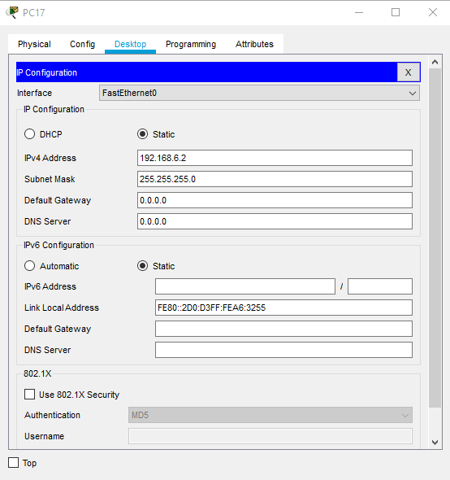 |
|:--:|
| Рисунок 7 - Присвоєння ІР-адреси через додаток "ІР Configuration". |

Очікується, що передавати пакети можна буде тільки між комп'ютерами, які були об'єднані в один VLAN. Для простоти, ІР-адреси відрізняються у третьому октеті. Так було легше присвоювати комп'ютерам ІР-адреси та не заплутатись. 
Інакше кажучі, перша група комп'ютерів має адреси "192.168.1.Х", друга - "192.168.2.Х" і так далі до "192.168.9.Х".

| 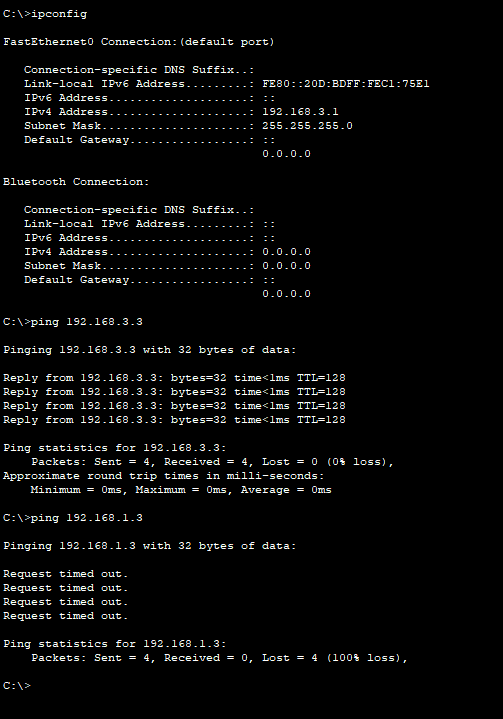 |
|:--:|
| Рисунок 8 - Перевірка працездатності. |

Завдання 3. Необхідно  змоделювати  локальну  мережу  комплексу  з  5 одноповерхових будівель. Одна будівля - 1 робоча група по 6 комп'ютерів. Мережа будується на основі маршрутизатора з одним портом. 

Під фразою "Мережа будується на основі маршрутизатора з одним портом" розуміється, що локальна мережа зможе виходити в глобальну мережу Інтернет через один порт. Візуально мережа виглядатиме таким чином:

| 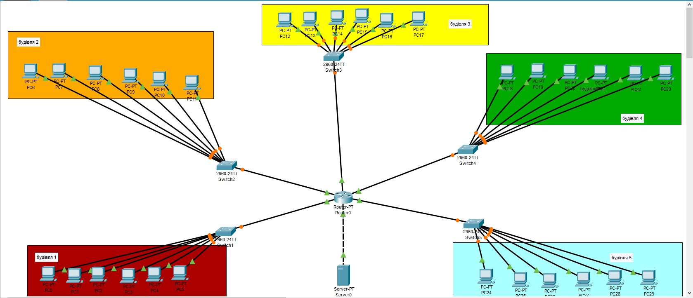 |
|:--:|
| Рисунок 9 - Топологія 3. |

Для спрошення сприйняття була впроваджена "візуалізація" будівель у вигляді різнокорольових прямокутників із надписом "будівля №".

Перевіримо працездатнысть. Для цього ми спробуємо "зв'язатися" з будівлею 4, находячись у будівлі 1:

| 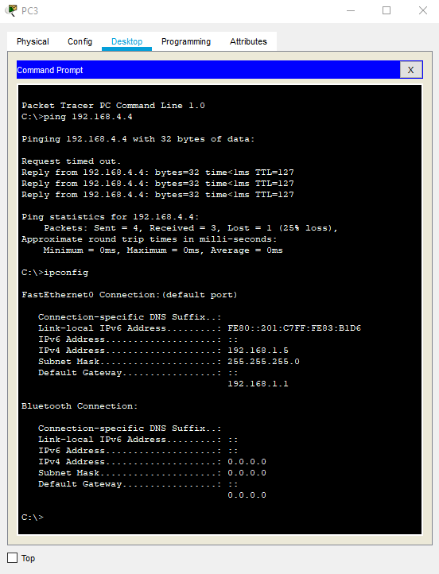 |
|:--:|
| Рисунок 10 - Перевірка працездатності мережі. |

Також у цій мережі буде розгорнутий сайт з назвою "stepаnov.com". Для цього додамо сервер до мережі, підключимо його до роутеру, встановимо серверу ІР-адресу, включимо такі функції, як HTTP та DNS, створимо просту HTML-сторінку та вкажемо адресу DNS-серверу в усіх комп'ютерах мережі.

Сервер вже був під'єднаний до роутеру, це можна побачити вище, на рисунку 10.
Тепер присвоємо йому ІР-адресу:

| 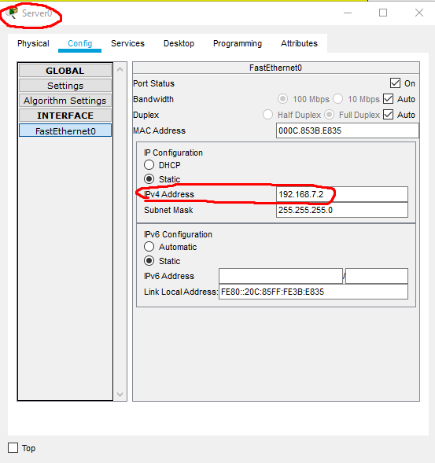 |
|:--:|
| Рисунок 11 - Присвоєння ІР-адреси серверу. |

Тепер створимо просту HTML-сторінку. Для цього треба натиснути на сервер, перейти у вкладку "services" та обрати у меню, що з'явилося, пункт "HTTP":

| 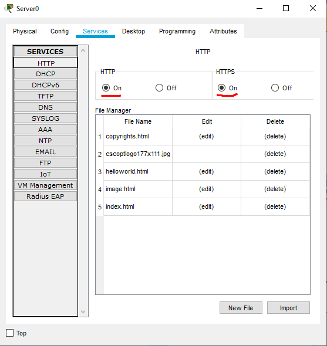 |
|:--:|
| Рисунок 12 - Налаштування сервісу HTTP. |

Обов'язково треба включити сервіс HTTP. Сам HTTP на даний час вже є застарілим, на його заміну прийшов HTTPS, у який були впроваджені сучасні механізми забезпечення безпеки. Тому бажаніше, щоб сайт працював саме по HTTPS. Але для експерименту включемо обидва протоколи.
Як ми бачимо, сервер вже має певний дефолтний сайт. Модифікуємо його. Навпроти файлу index.html натиснемо на кнопку "edit" та додамо наші привітання, прізвище та ім'я:

| 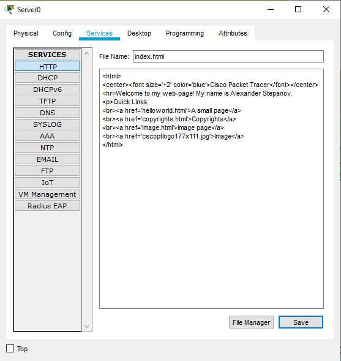 |
|:--:|
| Рисунок 13 - Редагування сторінки index.html. |

Все працює. Якщо вписати адресу нашого DNS-серверу у web-браузер будь-якого комп'ютеру з цієї мережі, то ми побачимо цю сторінку:

| 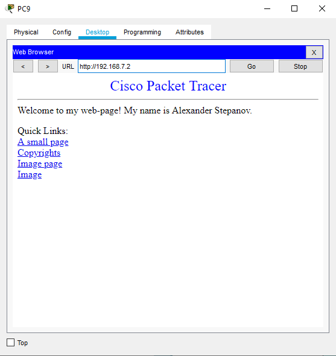 |
|:--:|
| Рисунок 14 - Перевірка роботи сайту. |

Але це ще не зовсім закінчений варіант. Справа у тому, що у наш час усі адреси "приховані" за їхніми символьними назвами. Коли ми пишемо адресу якогось сайту у пошуковій стрічці, ми не пишемо його ІР-адресу, ми пишемо його так звану "доменну назву", яка відповідає цієї адресі. Це робиться для того, щоб людям було легче запам'ятати шлях до сайту. Для того, щоб додати доменне ім'я нашому сайту, треба налаштувати функцію DNS у нашому сервері. Для цього треба натиснути на сервер, перейти у вкладку "services" та обрати у меню, що з'явилося, пункт "DNS". Нехай у нашого сайту буде назва "stepnov.com". Впишемо її у поле "Name" та впишемо ІР-адресу нашого серверу у поле "Address", після чого натиснемо на кнопку "Save".
І у списку нижче з'явиться перший запис. Дана операція вже була проведена, тому новий запис у таблиці не з'явиться.

| 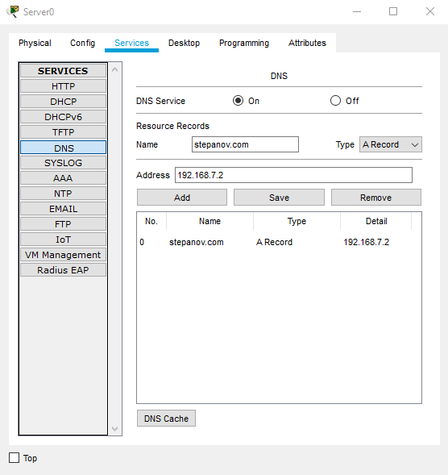 |
|:--:|
| Рисунок 15 - Налаштуваняя сервісу DNS. |

| 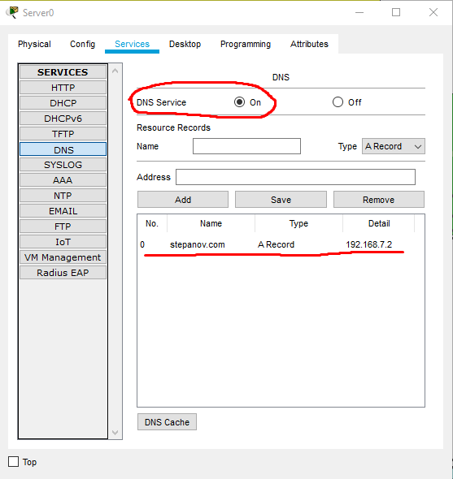 |
|:--:|
| Рисунок 16 - Налаштуваняя сервісу DNS. |

Тепер даний DNS-сервер необхідно вказати у конфігурації мережного обладнання комп'ютерів у даній мережі. Для цього натискаємо на комп'ютер, у підменю "Settings", що у меню "Global", вказуэмо ІР-адресу нашого DNS-серверу. Дану операцію слід провести в усіх комп'ютерах в мережі.

| 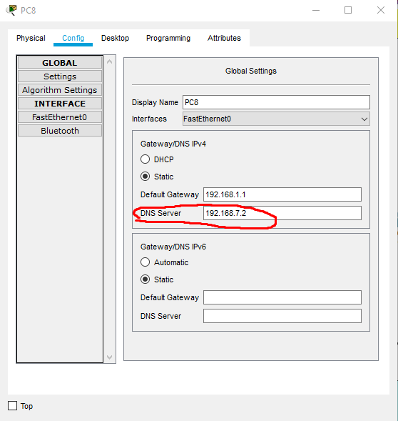 |
|:--:|
| Рисунок 17 - Налаштування DNS на комп'ютерах. |

Тепер DNS-налаштований в мережі. Для перевірки працездатності у пошуковому рядку web-браузеру пропишемо назву нашого сайту, а саме "stepanov.com".

| 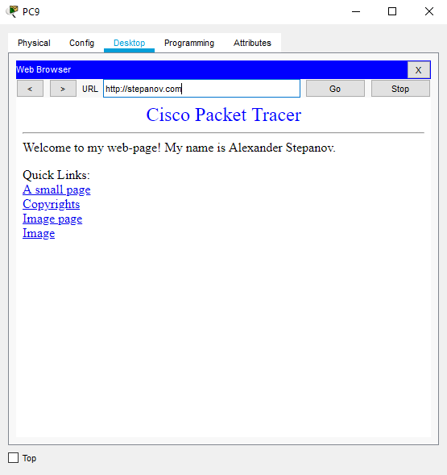 |
|:--:|
| Рисунок 18 - Перевірка роботи сервісу DNS. |

