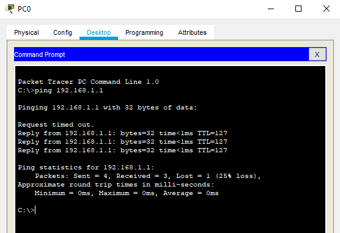

EPAM University Programs  
DevOps external course  
Module - NetworkingFundamentals
TASK4.3  
Завдання:  
Побудувати  локальну  мережу,  що  складається  з  сегмента  на  основі комутатора  з 5  комп'ютерів і сервера. Комутатор  з'єднаний    з маршрутизатором, до якого також підключений сервер. Необхідно задати статичні IP адреси мережних інтерфейсів маршрутизаторів, локальних   комп'ютерів   і   серверів.   Налаштувати   маршрутизацію   по протоколу RIP.Домогтися  можливості  пересилання  даних  по  протоколу  ICMP  між усіма об'єктами мережі.

1.Розставляємо  на  робочому  полі  необхідні  вузли,  використовуючи браузер в нижній частині вікна (рис. 1). З'єднуємо вузли відповідно до завдання за допомогою крученої пари.

|  |
|:--:|
| Рисунок 1 - Структура мережі. |

2. Задамо  ip-адреси  вузлів  сегмента  в  діапазоні  192.168.0.х, а сервера, підключеного до маршрутизатора - 192.168.1.1.   Маска   підмережі - 255.255.255.0. (Рис. 2)

|  |
|:--:|
| Рисунок 2 - Присвоєння ІР-адреси комп'ютеру. |

|  |
|:--:|
| Рисунок 3 - Присвоєння ІР-адреси серверу. |

3. Задамо  відповідні  ip  адреси  на  інтерфейсах  маршрутизатора  і включимо ці порти. (Рис. 4).

|  |
|:--:|
| Рисунок 4 - Налаштування порту маршрутизатора. |

4. Зайдемо  в  Command  Line  Interface  маршрутизатора  і  за  допомогою команди enable secret задамо пароль для  доступу і збережемо конфігурацію. (Рис.5)  
Для економії місця з рисунка були вирізані пусті строки, яки займали значну частину картинки.

|   |
|:--:|
| Рисунок 5 - Налаштування паролю для входу у режим конфігурування маршрутизатора.|

5. Для  налаштуваннямаршрутизації  по  протоколу  RIP  відкриємо вкладку  Config  у  вікні  властивостей  маршрутизатора  і  виберемо  пункт  RIP. Задамо там адреси всіх підмереж, яким дозволено спілкування. (Рис. 6).

|  |
|:--:|
| Рисунок 6 - Налаштування протоколу RIP в маршрутизаторі. |

Перевіряємо  доступність  робочих  станцій.  Для  цього  в  правій  колонці вибираємо  інструмент  Add Simple  PDU  і  вибираємо  станцію-відправник  і станцію-одержувач.  Переконуємося,  що  передача  завершена  успішно.  (Рис. 7)

|  |
|:--:|
| Рисунок 7 - Перевірка працездатності мережі через утиліту "Add Simple  PDU". |

Також перевірити працездатність можна за допомогою механізму "Command prompt" у вклaдці "Desktop". Цей механізм емулює командну строку операційної системи, завдяки чому можна скористатися командою "ping", яка відправляє ІСМР-пактеи до вказаного в команді комп'ютера.

|  |
|:--:|
| Рисунок 8 - Перевірка працездатності мережі через утиліту "ping". |
