EPAM University Programs  
DevOps external course  
Module -NetworkingFundamentals  
TASK4.4 bonus  
1.Завдання бонусне - не обов’язкове до виконання. За основу беремо будь яке завдання task 4.2 або 4.3 і у вашу існуючу мережу додаєте роутер,такщоб їх в мережі було не менше двох. І треба налаштувати трафік між двома мережами.Якщо ж у вашій існуючій мережі вже присутньо 2 роутера і трафік налаштований, то виконання цього завдання не потрібно.
За основу візьмемо топологію 1 з таску 4.2. Додаючи до цієї топології два роутера, отримуємо наступну топологію.

| 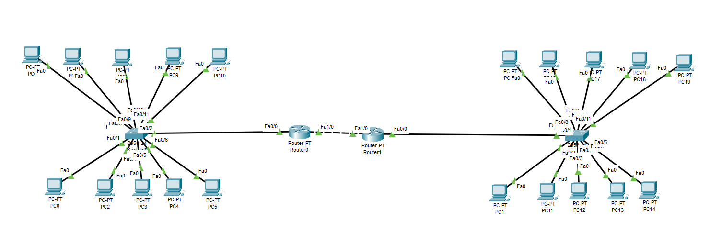 |
|:--:|
| Рисунок 1 - Модифікована топологія 1 у таску 4.2. |

Для того, щоб налаштувати трафік, спочатку треба задати ІР-адреси, розділити групи на 2 підмережі та налаштувати статичну маршрутизацію. Меражими будуть 192.168.1.0, 192.168.2.0 та 192.168.3.0. Остання підмережа буде використана для маршрутизаторів. Маршрутизація між підмережами виконується завдяки команді "ip route" безпосоредньо у маршрутизаторі.

Порти сконфігуровані наступним чином:
порти підмережі, які являються шлюзами для комп'ютерів, мають адреси 192.168.1.252 та 192.168.2.252 із масками 255.255.255.0
Адреси портів, через які маршрутизатори з'єднані між собою: 192.168.3.1 для роутеру 0 і 192.168.3.2 для роутеру 2 відповідно.

| 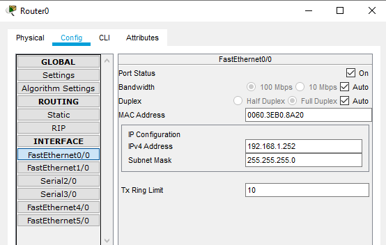 |
|:--:|
| Рисунок 2 - Налаштування портів роутеру 0. |

| 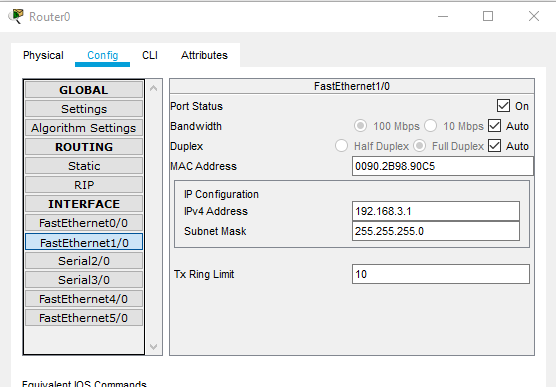 |
|:--:|
| Рисунок 3 - Налаштування портів роутеру 0. |

| 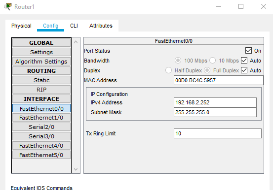 |
|:--:|
| Рисунок 4 - Налаштування портів роутеру 1. |

| 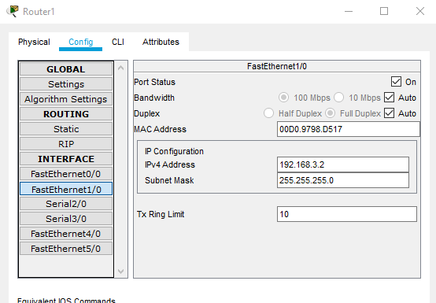 |
|:--:|
| Рисунок 5 - Налаштування портів роутеру 1. |

Налаштування статичної маршрутизації виконується у CLI роутеру. 
Це робиться в одну строку. Спочатку "ip route", потім ІР підмережі, яку ми хочемо бачити, маску підмережі (іншими словами, максимальна кількість комп'ютерів в підмережі яку ми хочемо бачити) а потім інтерфейс маршрутизатору, із якого буде виходити трафік до цієї мережі. Замість інтерфейсу можна вказати ІР-адресу порта іншого роутеру, який буде приймати даний трафік. Для збереження конфігурації треба зберегти її у пам'ять роутеру. Це робиться командою write mem. Таким чином, коли ми зайдемо у меню конфігурування роутеру 0, ми введемо такі команди:

enable  
configure terminal  
ip route 192.168.2.0 255.255.255.0 fa1/0 (або 192.168.3.2)  
exit  
write mem  

| 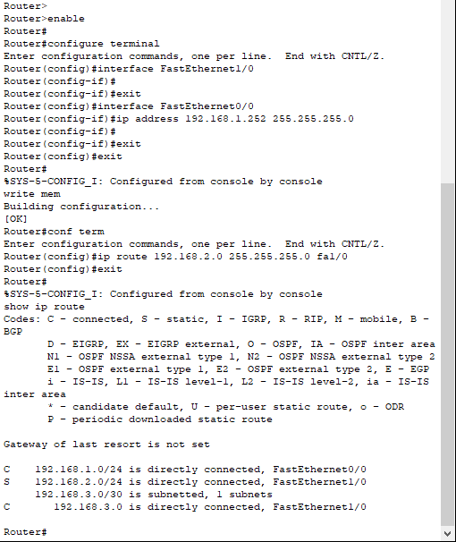 |
|:--:|
| Рисунок 6 - Налаштування статичної маршрутизації у роутері 0. |

Після того, як ми прописали дані команди, ми можемо подивитися, чи був сконфігурований статичний маршрут до мережі 192.168.2.0. Для цього ми скористалися командою "show ip route". Як видно у нижній частині з рисунку, що вище, біля адреси 192.168.2.0 стоїть позначка "S". Згідно з довідки, яка була показана, S значить те, що маршрут статичний. Із цього можна зробити висновок, що команда спрацювала правильно, маршрут сконфігурований.

Аналогічні дії робимо для роутеру 1.

| 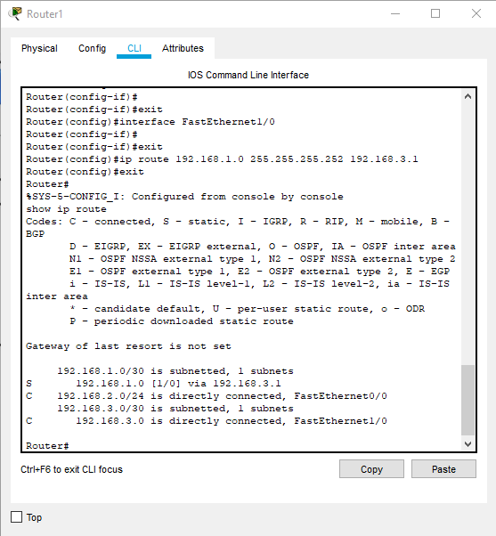 |
|:--:|
| Рисунок 7 - Налаштування статичної маршрутизації у роутері 1. |

Тепер перевіримо працездатність мережі. Для цього пропінгуємо мережу 2 із мережі 1. Спочатку зробимо це через роутер 0. Це дуже важливо, бо після сконфігурування мережі та пінгування іншох мережі через комп'ютер, воно може просто не спрацювати. Але якщо пропінгувати комп'ютер з іншої мережі спочатку з роутеру, а потім вже з "нашого" комп'ютера - то все працюватиме.

| 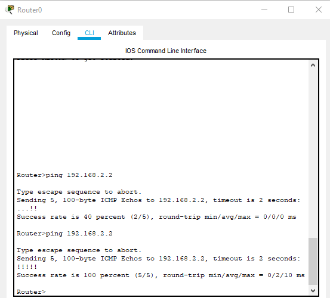 |
|:--:|
| Рисунок 8 - Перевірка, чи бачить роутер 0 підмережу 192.168.2.0. |

| 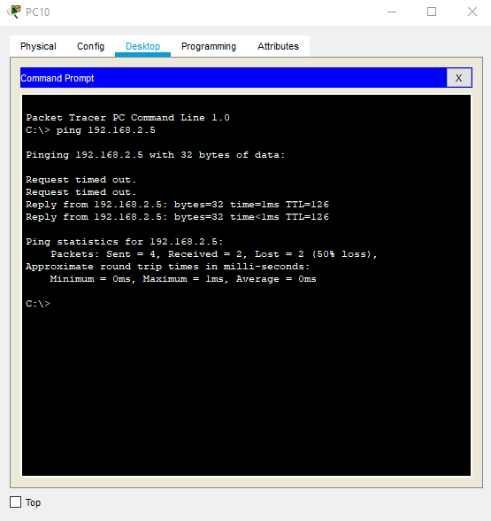 |
|:--:|
| Рисунок 9 - Перевірка працездатності мережі через утиліту "ping". |

| 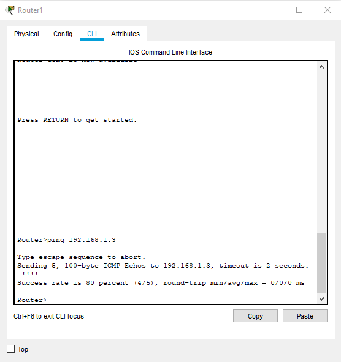 |
|:--:|
| Рисунок 10 - Перевірка, чи бачить роутер 1 підмережу 192.168.1.0. |

| 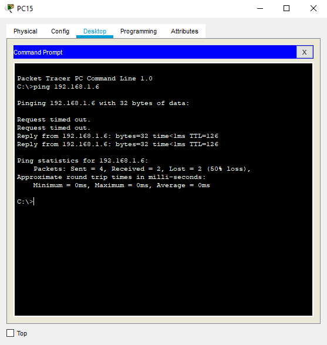 |
|:--:|
| Рисунок 11 - Перевірка працездатності мережі через утиліту "ping". |

2.Завдання бонусне - не обов’язкове до виконання.Організувати 2 підмережі. Налаштувати DNS на серверах.

У нашму випадку мережа виглядатиме таким чином:

| 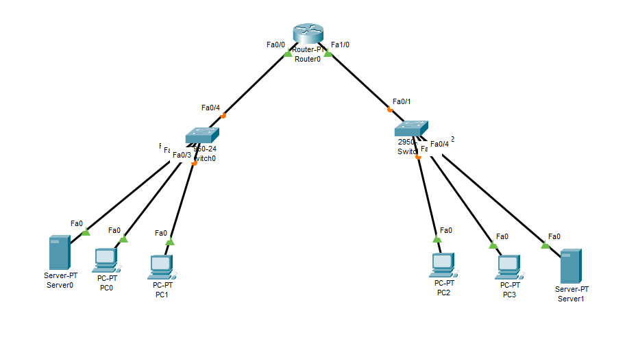 |
|:--:|
| Рисунок 12 - Топологія 2. |

Адреси роутеру для двох різних підмереж: 192.168.0.253 та 192.168.1.253, маска в обох випадках 255.255.255.0.

| 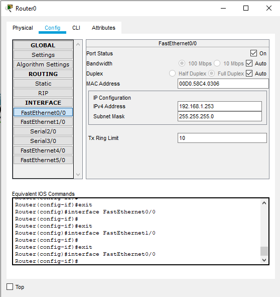 |
|:--:|
| Рисунок 13 - Налаштування портів роутеру 0. |

| 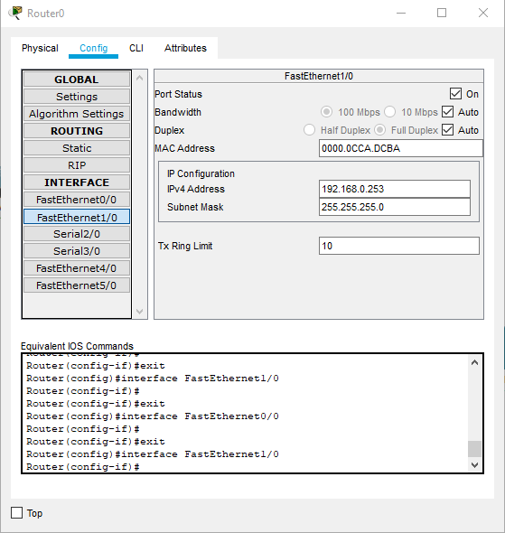 |
|:--:|
| Рисунок 14 - Налаштування портів роутеру 0. |

Налаштування DNS відбувається на сервері, тому переходимо до налаштування серверу.

| 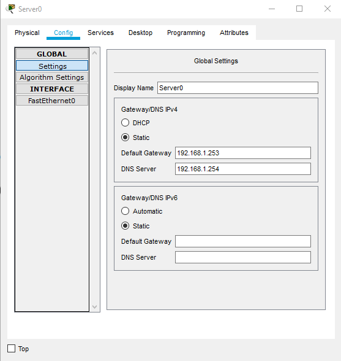 |
|:--:|
| Рисунок 15 - Налаштування DNS-серверу. |

| 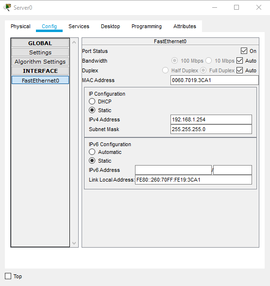 |
|:--:|
| Рисунок 16 - Присвоєння ІР-адреси DNS-серверу. |

Для того, щоб відрізнити сервери між собою, трішки змінимо текст у HTML-сторінці.  

| 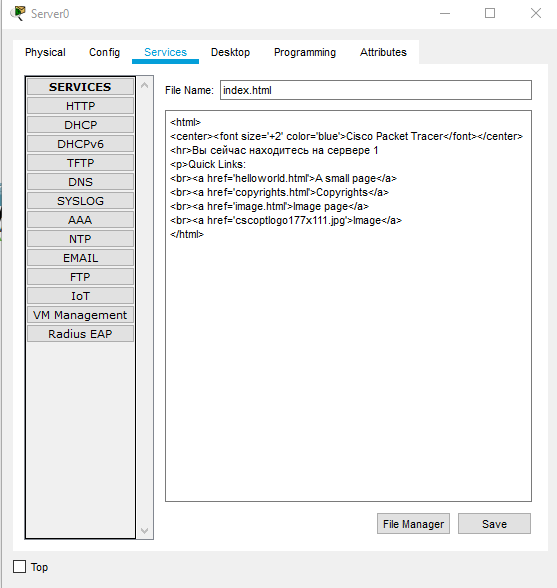 |
|:--:|
| Рисунок 17 - Редагування HTML-сторыінки сайту сервера. |

Також додамо записи про ці сервери у сервісі DNS. Для того, щоб було легше відрізнити сервери один від одного, ми назвемо сайти "server1.com" та "server2.com" відповідно.

|  |
|:--:|
| Рисунок 18 - Процес створення DNS-записів. |

| 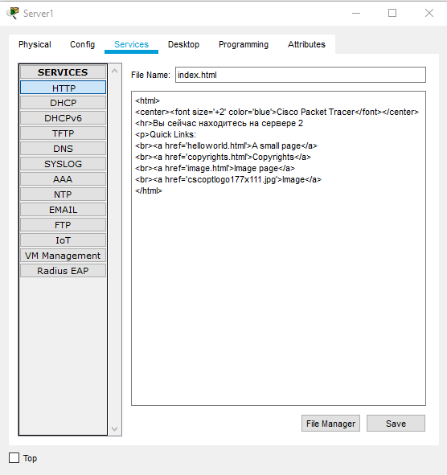 |
|:--:|
| Рисунок 19 - Редагування HTML-сторінки сайту сервера. |

| 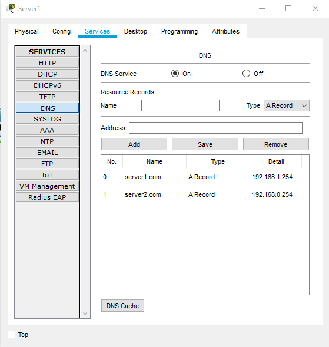 |
|:--:|
| Рисунок 20 - Процес створення DNS-записів. |

Тепер перевіримо працездатність DNS. Звернемося до цих серверів з одного комп'ютера. Це буде свідчити як про працездатність серверів, та і про працездатність мережі в цілому.

| 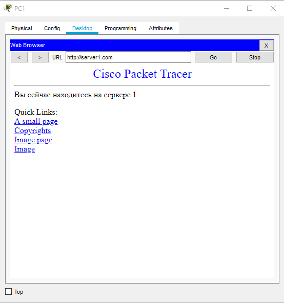 |
|:--:|
| Рисунок 21 - Перевірка працездатності мережі через Web-браузер. |

| 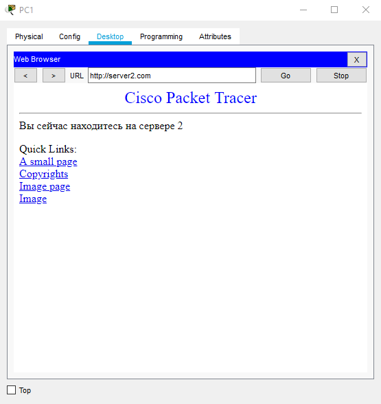 |
|:--:|
| Рисунок 22 - Перевірка працездатності мережі через Web-браузер. |
