Linux administration with bash. Home task
1.Create virtual machines connection according to Picture 1:

| 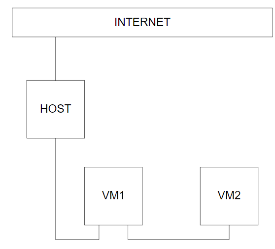 |
|:--:|
| Picture 1 - VMs connection. |

2. VM2 has one interface (internal), VM1 has 2 interfaces (NAT and internal). Configure  all networkinterfaces in order to make VM2 has an access to the Internet (iptables, forward, masquerade).   

To create such a network the specific vagrantfile was used. To set Internal network on two machines the line "virtualbox_intnet: true" was used. To set NAT adapter we pointed out general settings of the adapter, such as IP-address and forwarded port.

| 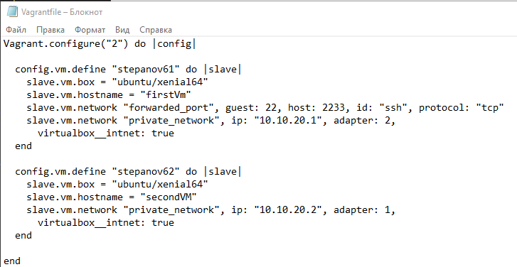 |
|:--:|
| Picture 2 - The structure of the vagrantfile. |

Now let's check if the settings in the vagrantfile worked correctly. To make sure that everyting is OK we checked the setting in the Virtualbox GUI.

| 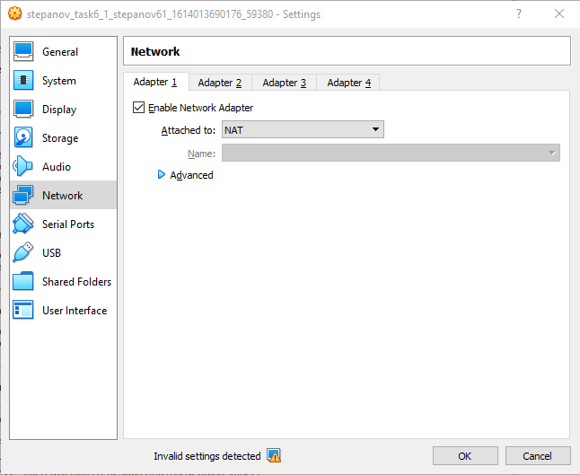 |
|:--:|
| Picture 3 - Checking the network adapters of the router machine. |

| 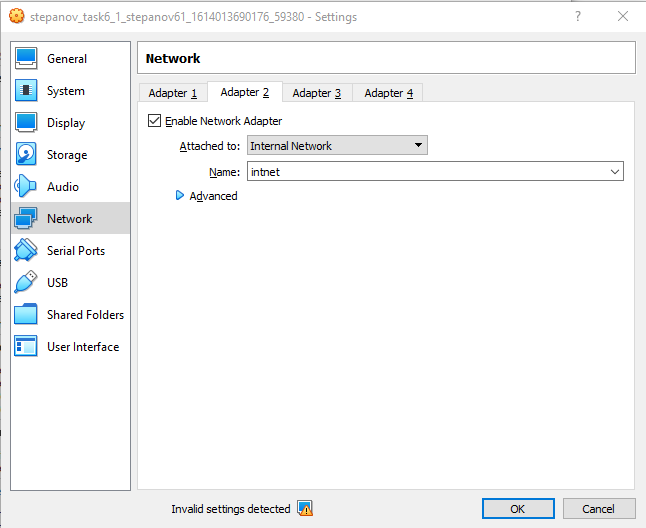 |
|:--:|
| Picture 4 - Checking the network adapters of the router machine. |

| 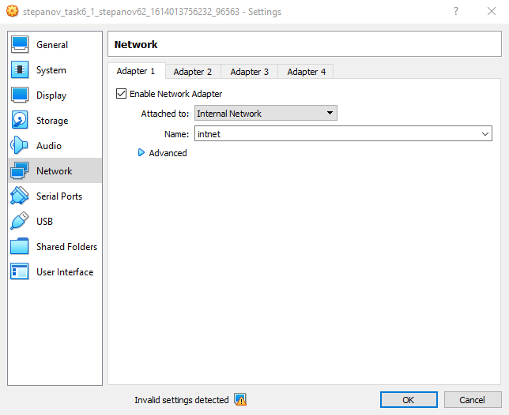 |
|:--:|
| Picture 5 - Checking the network adapters of the internal machine. |

The files /etc/network/interfaces must contain the following content:

The NAT machine:

| 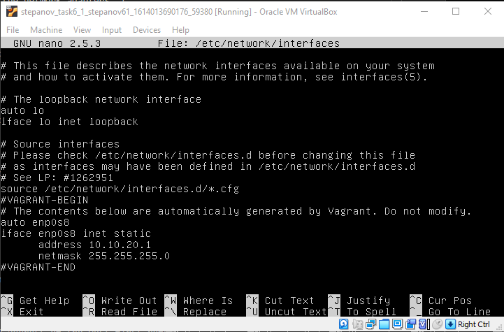 |
|:--:|
| Picture 6 - The content of the file /etc/network/interfaces of the router. |

The internal machine:

| 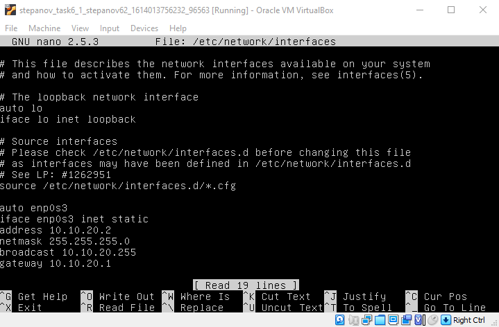 |
|:--:|
| Picture 7 - The content of the file /etc/network/interfaces of the internal machine. |

And now let's check if the IP-addresses are set up correctly. We will do it directly in the virtual machines using the command ip a (ip addr).

| 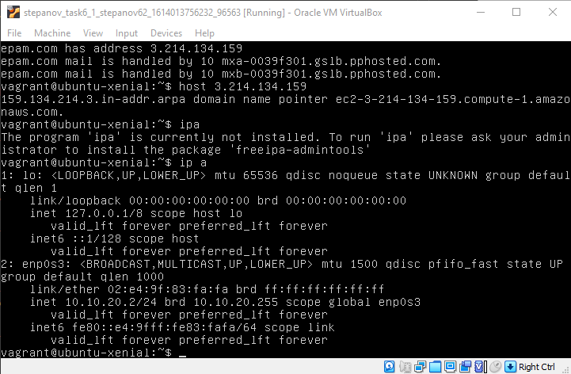 |
|:--:|
| Picture 8 - Checking the IP-address of the router. |

| 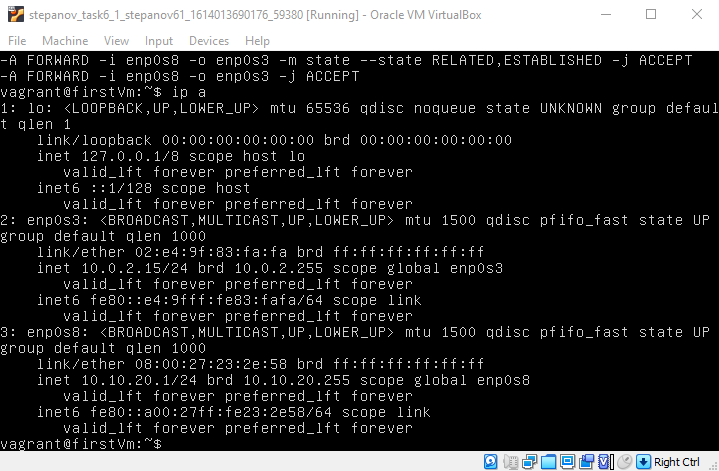 |
|:--:|
| Picture 9 - Checking the IP-address of the internal machine. |

Both the first and the second machines were adjusted correctly. Now let's get down to the further adjusting.

Now we need to set port-forwarding. Firstly enable forwarding in the system file "/etc/sysctl.conf" on the router.

There is a specific command that makes us able to set port-forwarding. The name of the command is "iptables". Type such three command in the terminal to adjust port-forwarding in the router:

| 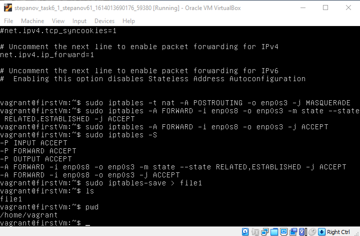 |
|:--:|
| Picture 10 - Setting iptables. |

As you can see we also wrote the iptables settings in the file "file1". It need to prevent monotonous setting the iptables after rebooting. Iptables settings can be restored by the command "sudo iptables-restore file1".

|  |
|:--:|
| Picture 11 - Restoring iptables settings. |

Let's try to connect to the VM using the IP-address of the host machine.
We need to check the IP-address of the Host first before connecting. The port was set in the vagrantfile (2233).

| 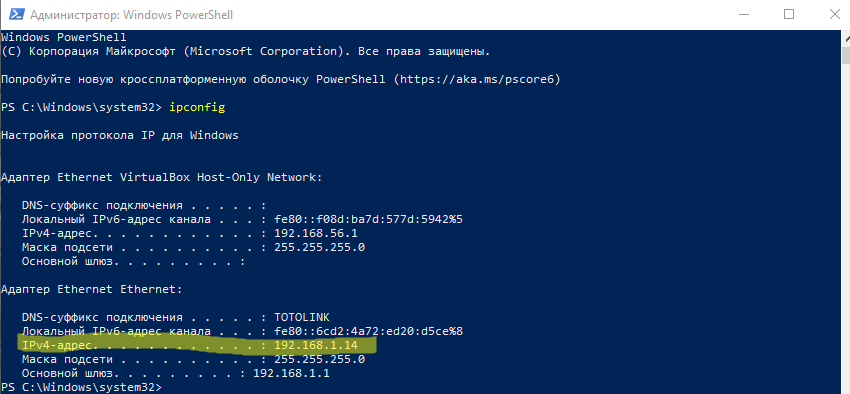 |
|:--:|
| Picture 12 - Checking the network adapters. |

| 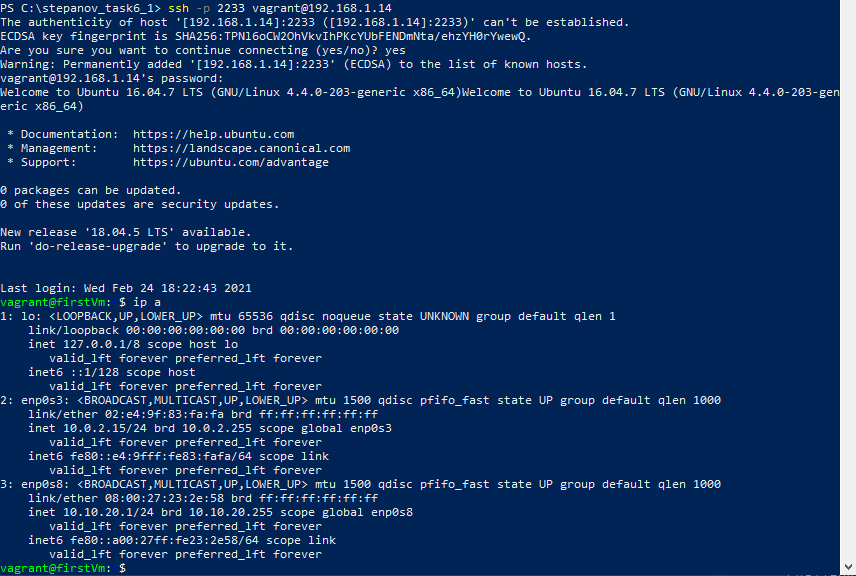 |
|:--:|
| Picture 13 - Connectiong to the VM. |

Make sure that password authentication is allowed in the system. Otherwise you won't be able to connect to the VM. It is essential because I faced the problem of establishing the connection that was sorted out in such a way.

| 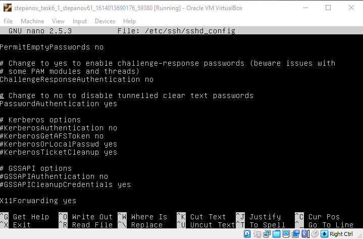 |
|:--:|
| Picture 14 - Setting password authentication. |

3. Check the route from VM2 to Host. 

Also we need to set the DNS-server in the file "/etc/resolv.conf".

| 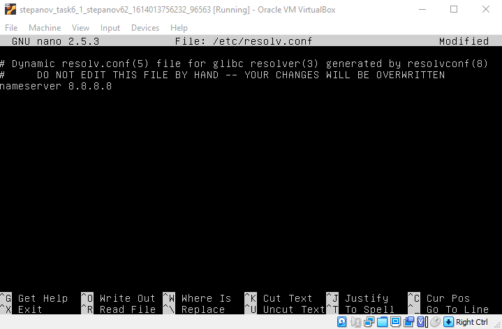 |
|:--:|
| Picture 15 - Setting DNS-server. |

Now we are ready for checking the route. There is a command that is used to watch the route to the destination. 

| 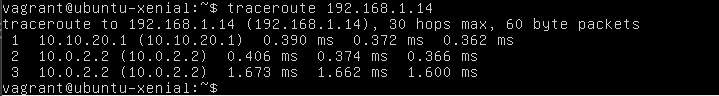 |
|:--:|
| Picture 16 - Checking the route from VM2 to Host. |

As we can see. The packets go through the router-VM (10.10.20.1).

4. Check the access to the Internet, (just ping, for example, 8.8.8.8). 

It is essential that we need to set the DNS-server to have the connection to the Internet. It was mention above in the subtask 3.

| 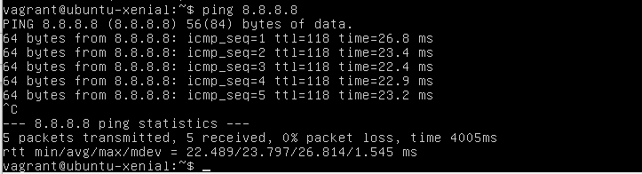 |
|:--:|
| Picture 17 - Sending ICMP-packets to the 8.8.8.8. |

5. Determine, which  resource has an IP address 8.8.8.8.

The command gives you an opportunity to define the name of the host by the IP-address and vice versa.

| 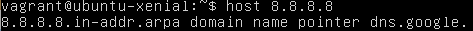 |
|:--:|
| Picture 18 - The example of using "host" command. |

According to the result of the command. The address 8.8.8.8 belons to the DNS-server of Google.

6. Determine, which  IP address belongs to resource epam.com. 

To determine the IP-address that belongs to the resource epam.com we will use the command "host" as we did it in the subtask above.

| 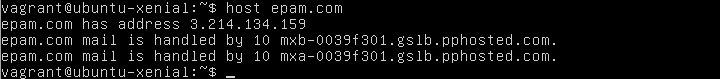 |
|:--:|
| Picture 19 - The example of using "host" command. |

The command says that epam.com has the address 3.214.134.159.

7. Determine the default gateway for your HOST and display routing table. 

The command "route" can help us to check both the routing tables and the main gateway of the host.

The routing tables is the database that is stored in the router. It describes the connection between the nearest routers. Routing table represents the simplest rule of routing. Usually, routing table contains in IP-address, mask, gatewaym interface that is used to connect to this router and metrics. Metrics is a specific system of measuring the distance between the routers. The less the distance, the better. So the the address with the lowest metrics is the most preferred one.

| 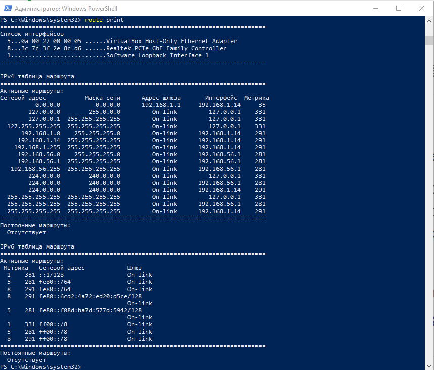 |
|:--:|
| Picture 20 - Checking the routing tables and the main gateway. |

We can also define the gateway of your host with the help of the "ipconfig" command.

| 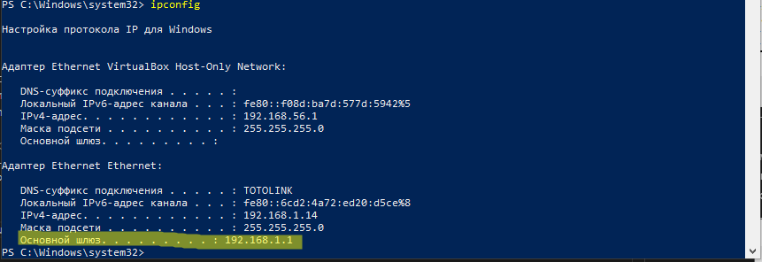 |
|:--:|
| Picture 21 - Checking the main gateway. |

8. Trace the route to google.com. 

We'll use "traceroute" to  watch the route to the site google.com as we've already done it above to check the route to our host machine.

| 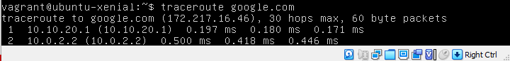 |
|:--:|
| Picture 22 - Watching the route to google.com. |
