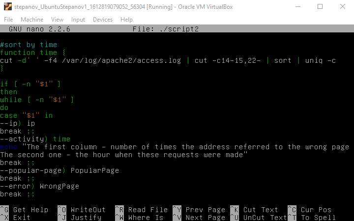
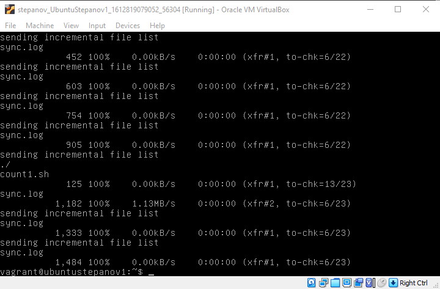

Linux administration with bash. Home task

A. Create a script that uses the following keys:
1. When starting without parameters, it will display a list of possible keys and their description. 
2. The --all key displays the IP addresses and symbolic names of all hosts in the current subnet 
3. The --target key displays a list of open system TCP ports.
The code that performs the functionality of each of the subtasks must be placed in a separate function

At the beginning of the code we create function we will call from the second half of the script.

$1 is a bash-variable that indicates the number of the attribute when we launch the script. There are nice variables that match its options. If you want to operate with more than nine options, you can refer to this variable using the form ${*} , when the star is a number of a variable.

In conditions we check if the variable is empty (-n) or absent (-z). Having used the switch-case cycle, we called the functions created above and set the actions for case when no options are pointed out.

|  |
|:--:|
| Picture 1 - The first half of the code of the script. |

|  |
|:--:|
| Picture 2 - The second half of the code of the script. |

|  |
|:--:|
| Picture 3 - Testing work. |

|  |
|:--:|
| Picture 4 - Testing work. |

#!/bin/bash
if [ -n "$1" ]
then
while [ -n "$1" ]
do
case "$1" in
--all) cat /etc/hosts 
break ;;
--target) ss 
break ;;
*) echo "The possible keys:
--all key displays the IP addresses and symbolic names of all hosts in the current subnet 
--target key displays a list of open system TCP ports" ;;
esac
done
elif [ -z "$1" ]
then
echo "The possible keys:
--all key displays the IP addresses and symbolic names of all hosts in the current subnet 
--target key displays a list of open system TCP ports"
fi

B. Using Apache log example create a script to answer the following questions:
1. From which ip were the most requests? 
2. What is the most requested page? 
3. How many requests were there from each ip? 
4. What non-existent pages were clients referred to?  
5. What time did site get the most requests? 
6. What search bots have accessed the site? (UA + IP)

All the actions except defining the time when then site was requested most of all were made in the only one script with several parameters.  
Certain parameter matches certain actions.  
In most functions we used "cut" to extract some columns with certain data in the file /var/log/apache2/access.log.  
The process of defining the parameters was made with the "case" operator.
THis script can take only one parameter.

|  |
|:--:|
| Picture 5 - The structure of the code. |

In the function ip we used sed to take out the certain data from the text file access.log.

|  |
|:--:|
| Picture 6 - The structure of the code. |

|  |
|:--:|
| Picture 7 - The structure of the code. |

|  |
|:--:|
| Picture 8 - The structure of the code. |

|  |
|:--:|
| Picture 9 - The structure of the file "count.sh". |

|  |
|:--:|
| Picture 10 - Testing work and the parameters. |

|  |
|:--:|
| Picture 11 - Testing work and the parameters. |

|  |
|:--:|
| Picture 12 - Testing work and the parameters. |

C. Create a data backup script that takes the following data as parameters:
1. Path to the syncing  directory.
2. The path to the directory where the copies of the files will be stored.
In case of adding new or deleting old files, the script must add a corresponding entry to the log file indicating the time, type of operation and file name. [The command to run the script must be added to crontab with a run frequency of one minute]

To indicate the date when the script was performed we write current data in the sync.log when script is performed.

|  |
|:--:|
| Picture 13 - The code of the script. |

Now we added the script to crontab with a run frequency of one minute.

|  |
|:--:|
| Picture 14 - Adding the script to crontab. |

On the screenshots below you can see how this script works.

|  |
|:--:|
| Picture 15 - How the script works. |

|  |
|:--:|
| Picture 16 - The content of the logfile sync.log. |

When we added file count.sh it was logged in the logfile.

|  |
|:--:|
| Picture 17 - Checking logfile. |

Also this logfile contain in some deletions of file. We  checked it with grep command.

|  |
|:--:|
| Picture 18 - Checking logfile. |